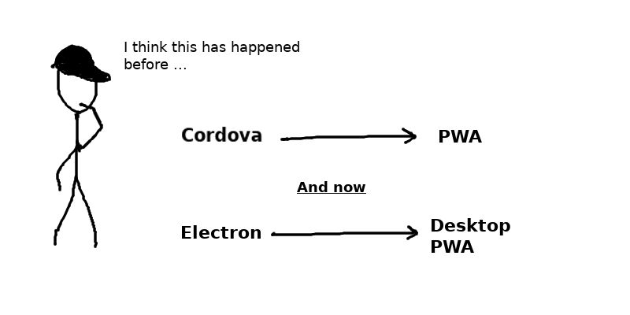

A Progressive Web Apps (PWA) is an application that functions like a native application but is delivered through the web.

<blockquote>
Progressive Web Apps are user experiences that have the reach of the web, and are: 
-  Reliable:  Load instantly and never show the downasaur, even in uncertain network conditions. 
-  Fast:  Respond quickly to user interactions with silky smooth animations and no janky scrolling. 
-  Engaging:  Feel like a natural app on the device, with an immersive user experience. 
This new level of quality allows Progressive Web Apps to <strong><u>earn a place on the user's home screen.</u></strong> 
</blockquote>

Progressive web app are becoming very popular on Android and iOS these days. Many tech giants like Flipkart, Financial Times and Telegram are using it in production for targetting their iOS & Android users. Recently, [Google Chrome launched progressive web app support for desktop browsers as well](https://developers.google.com/web/updates/2018/05/dpwa). What this means is, now you can build web apps that function like native apps and can be launched from native start menu of the desktop environment: Windows, OSX or Linux (Ubuntu).

<small>Side by side: PWA on Desktop &amp; Mobile <a href="https://emojityper.com/" target="_blank">(emojityper.com)</a></small>

## But for Desktop apps there is Electron already

Until now only production ready way to run standalone web apps in the desktop was using [Electron](https://electronjs.org/). 

PWAs solve a lot of issues that came with Electron based apps.

1. **Packaging/distribution** : Electron apps always bundled entire chromium and node engine along with the web app. This made the app size huge. A minimum hello world app would go upto 120MB. With PWAs, the user does not need to visit an app store and download an external app. The user simply visits the website and if he/she likes the content/service, then they just press a button to "add to Homescreen" and the app is now available offline.

2. **App updates**: Updating Electron apps were a pain. You often needed to send huge chunks of resource files to update the app. With PWA, app updates are as easy as updating the web apps. No need to download the the entire application. Only the resources that updated can be fetched.

3. **Resource Intensive**: Running multiple Electron apps would eat up a lot of your CPU and RAM because each app would launch separate instances of chromium engine and node. Running a desktop PWA is like opening another Tab on the chrome. Thus, an entire chromium engine need not be downloaded again and run separately. 

4. **Safe/Sandboxed**: PWAs run inside the browser sandbox and hence are much safer to install and run.

## Enabling Support for PWAs

As of Aug 14, 2018 both **Android** and **iOS** have great support for PWAs. 
The support for PWAs on desktop are limited at the moment but it is expected to be implemented by all major browsers soon. 

**Chrome**

PWAs on desktop are supported on Chrome OS 67, which was released in May, 2018. They are experimental at the moment and need to be enabled.
Type in the url field of chrome: `chrome://flags/#enable-desktop-pwas`
And change then change the drop down to enabled. Now relaunch chrome.

**Microsoft Edge**

https://docs.microsoft.com/en-us/microsoft-edge/progressive-web-apps#current-availability

**Firefox**

Not supported when this blog was written

**Safari**

Not supported when this blog was written

Although support for Desktop PWA is limited at the moment you can start developing them. PWAs are far more superior as compared to a regular web app because they give the user a reliable, fast and engaging experience. Moreover, support for PWAs on Android and iOS are already present. Hence, if you build a Desktop PWA now, you could target the web and mobile platforms with desktop support added automatically when browsers start supporting them.

## Demos to inspire before we code

Open up these demos on your phone(Android or iOS) and desktop(after enabling PWA support): 
Recommended browser: chrome

- **Financial Times**
https://app.ft.com/

- **Air horn app**:
https://airhorner.com/

- **Emoji Typer**:
https://emojityper.com/

- **Telegram**:
https://web.telegram.org

More at [https://pwa.rocks/](https://pwa.rocks/)

## Criteria for a web app to become a PWA

Progressive - Works for all users irrespective of browser choice and platform. 
Hence, for a web app to be progressive it needs follow certain guidelines

1. Responsive - Fits any form factor: desktop, mobile, tablet, or whatever is next.
2. Connectivity independent - Works offline or even on low-quality networks.
3. App-like - Feels like a native app: Should have fluid animations and great navigation.
4. Fresh - Always up-to-date.
5. Safe - HTTPS enabled.
6. Discoverable - Easier for search engines to find it.
7. Re-engageable - Makes re-engagement easy through features like push notifications.
8. Installable - Users can launch the app via the home screen without the hassle of an app store.
9. Linkable - Easily share the application via a simple URL.

### Responsive

Use meta tags
Use media queries
Use content based media queries and not device based
Always go small to big
<meta http-equiv="X-UA-Compatible" content="IE=edge">

### App-like and Connectivity independent

To achieve an app like feel and offline support we will use the "App shell" architecture model.

### Fresh
Service workers to update data

### Safe
Make sure you enforce HTTPS for all your production sites.
For setting up HTTPS on your development environment you can read my earlier blog post [https://blog.atulr.com/localhost-https/](https://blog.atulr.com/localhost-https/) 

### Discoverable
App manifest

### Re-engageable via Push notifications

To add support for push notifications we will use service workers.

### Installable - 

Criteria for before install prompt

- The web app is not already installed
- Meets a user engagement heuristic (currently, the user has interacted with the domain for at least 30 seconds)
- Includes a web app manifest that includes:
    short_name or name
    icons must include a 192px and a 512px sized icons
    start_url
    display must be one of: fullscreen, standalone, or minimal-ui
- Served over HTTPS (required for service workers)
- Has registered a service worker with a fetch event handler

//MANIFEST JSON
//==============
1. short_name is used on the user's home screen, launcher, or other places where space may be limited.
2. name is used on the app install prompt.
3. If shortname is not provided then name will be used.
4. icons - used in places like the home screen, app launcher, task switcher, splash screen, add to homescreen prompt etc.
5. The start_url tells the browser where your application should start when it is launched, and prevents the app from starting on whatever page the user was on when they added your app to their home screen.
6. background_color - this is the splash screen background_color
7. display - UI mode to launch the app in.
"
fullscreen 	Opens the web application without any browser UI and takes up the entirety of the available display area.
standalone 	Opens the web app to look and feel like a standalone native app. The app runs in it's own window, separate from the browser, and hides standard browser UI elements like the URL bar, etc.
minimal-ui 	Not supported by Chrome
This mode is similar to fullscreen, but provides the user with some means to access a minimal set of UI elements for controlling navigation (i.e., back, forward, reload, etc).
browser 	A standard browser experience.
"
8.orientation : "landscape || portrait"
9. scope

The scope defines the set of URLs that the browser considers within your app, and is used to decide when you’ve left your app, and should be bounced back out to a browser tab. The scope controls the url structure that encompasses all the entry and exit points in your web app. Your start_url must reside within the scope.

"scope": "/maps/"

A few other tips:

    If you don't include a scope in your manifest, then the default implied scope is the directory that your web app manifest is served from.
    The scope attribute can be a relative path (../), or any higher level path (/) which would allow for an increase in coverage of navigations in your web app.
    The start_url must be in the scope.
    The start_url is relative to the path defined in the scope attribute.
    A start_url starting with / will always be the root of the origin.

--------------------

### Linkable
Make sure your web app has correct urls to access each and every page. So that a link can be shared.

### Checklist

Checklist:
https://developers.google.com/web/progressive-web-apps/checklist#baseline

### Compatibility
PWA Compat: https://developers.google.com/web/updates/2018/07/pwacompat

### Recent Changes
Previous to Chrome 68, 
In Android: the PWA install app prompt used to come automatically,
but from chrome 68 and onwards, the prompt no longer shows automatically, 
https://developers.google.com/web/updates/2018/07/nic68#a2hs

and hence, we have more control over it now.

# PRPL Pattern

## References
https://developers.google.com/web/progressive-web-apps/
https://developers.google.com/web/progressive-web-apps/checklist
https://developers.google.com/web/fundamentals/performance/prpl-pattern/
https://justmarkup.com/log/2018/02/pwa-on-desktop/
https://developers.google.com/web/fundamentals/codelabs/your-first-pwapp/

We will be building a Job board pwa which will help u find jobs.
So by end of this tutorial u can build a PWA and get a job ;)