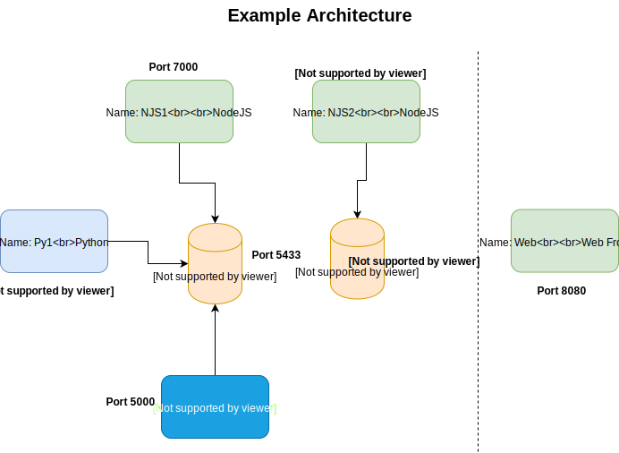
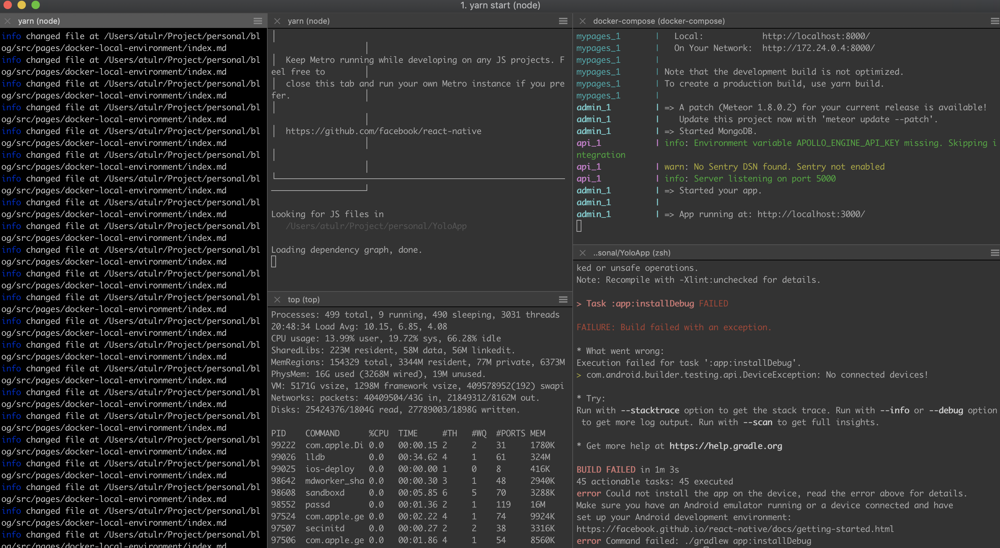
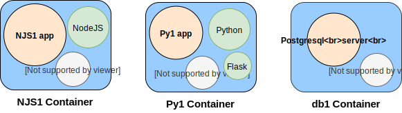
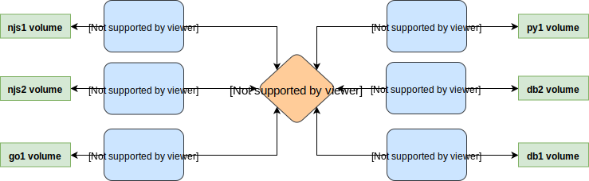

I recently started working at <a href="https://anyfin.com/en" target="_blank">Anyfin</a>. As a new engineer on the team, I had to setup the entire development environment. Drawing my expectations from my previous work engagements I thought this would take me a couple of days. But to my surprise I had a working setup of quite a few backend services written in NodeJS, Golang and Python along side the web site and portal (Javascript) in ~5hrs.
This post will explain on how we use Docker at Anyfin to setup a productive local development environment quite easily. I have seen such attempts at my previous workplaces before but none of those have worked as seamlessly as the one we have here.

**👮🏻‍Credit disclaimer:🚨** <br/>

The entire credit for the setup goes to my colleagues at Anyfin.
I found the setup at Anyfin extremely awesome and hence wanted to share it with everyone.

## 🧦 Example Architecture

Lets say we have a set of services that have the following architecture.



From the diagram we can see we have:

- NJS1 - NodeJS service running on port **7000** and dependent on the database Db1 (running on port **5433**).
- Py1 - Python service running on port **9000** and dependent on the database Db1 (running on port **5433**).
- Go1 - Golang service running on port **5000** and dependent on the database Db1 (running on port **5433**).

---

- NJS2 - NodeJS service running on port **8000** and dependent on the database Db2 (running on port **5432**).

---

- Web - A simple webpack based dev server for frontend running on port **8080**.

_PS: We want the services to be exposed on the said ports in the local environment so that they can communicate with each other via those._

For simplicity, lets consider that all of these services just return the message:

```
Hello from <service name>
```

So, if you hit **GET http://localhost:7000**, you should get

```
Hello from njs1
```

The code for these services are here: <a href="https://github.com/master-atul/blog-docker-dev-environment-example" target="_blank">https://github.com/master-atul/blog-docker-dev-environment-example</a>

Lets run all of our services on different terminal windows and try it out.
<br/>

## 💩 We typically face these issues with this setup

1. **Terminal hell:** To run all of those services, we would need to open up mulitple terminal tabs/windows and then run them separately (It would look like this). This will become more harder to manage as the number of services grow.



<center><sub><i>Typical terminal layout of a developer working with multiple services</i></sub></center>
<br/>

2. **Incompatible dependencies**: Lets say our services depend on different node versions. In such cases we would need to manually switch node versions before running our services. Similarly, if our services depend on multiple database servers, then we would need to make sure our database servers are running (on different ports) before we can run our services. All of this is mostly manual and cumbersome.

3. **Fresh setup**: Setting up all of this services on a new machine can be tricky as we need to keep track of all the dependencies we need and their corresponding versions. This leads to the popular **"Works on my machine"**.

All of these are frankly annoying 🤯.

## 🕶 Docker based local development environment

> Docker is a tool designed to make it easier to create, deploy, and run applications by using containers. Containers allow a developer to package up an application with all of the parts it needs, such as libraries and other dependencies, and ship it all out as one package.

### Mental model 🧞‍

#### Docker container

To form a mental picture, for the time being just consider a **Docker Container** as an extremely light weight isolated linux based virtual machine inside which we will run our application service (<a href="https://www.backblaze.com/blog/vm-vs-containers/" target="_blank">although containers are not exactly VMs</a>). The container will contain our code and all of its dependencies (system libraries, tools, etc). For our setup we will use one docker container per service and separate docker containers for our database.



#### Docker-Compose

> Docker compose is a tool for defining and running multi-container Docker applications. With Compose, you use a YAML file to configure your application’s services. Then, with a single command, you create and start all the services from your configuration.

**TLDR;** Docker compose lets you run all your services at once (also in the right order) and manage them via a unified interface.

Docker compose in general will contain:

- **Services**: Services are the list of induvidual docker containers that will be run by the compose tool. We will specify the ports and other configurations needed to run the docker containers here.

- **Networks**: Network provides a way by which different services can interact with each other. Each container can attach itself to a network and all containers within same networks can communicate with each other. We will use a single network for our case.

- **Volumes**: Docker containers by default do not contain any kind of persistence storage. If a docker container is killed then all the data in its memory gets lost. So in order to save some persistant data you need volumes. Think of volumes as permanent hard drives for these containers. We will have one volume per service.



<br/>

## 🚀 Setting it up

I have created a basic setup of services as described above. To follow along, take a clone of the repo with the following commands.

```sh
git clone https://github.com/master-atul/blog-docker-dev-environment-example.git

cd blog-docker-dev-environment-example

git checkout tags/basic-setup

git checkout -b tryingout
```

Now you should have the following project structure to start with:

```js
.
├── go1
│   ├── README.md
│   └── main.go
├── njs1
│   ├── README.md
│   ├── index.js
│   ├── package-lock.json
│   └── package.json
├── njs2
│   ├── README.md
│   ├── index.js
│   ├── package-lock.json
│   └── package.json
└── py1
    ├── README.md
    ├── requirements.txt
    └── server
        ├── __init__.py
        └── __main__.py

```

You could browse through each project inside and read the README to understand how to run those projects induvidually.

### Enter docker 🚪

Make sure you have docker running by following the instructions here <a href="https://www.docker.com/get-started" target="_blank">https://www.docker.com/get-started</a>.

First step is to create a docker file for our service njs1. Create a Dockerfile: **blog-docker-dev-environment-example/njs1/Dockerfile**

`njs1/Dockerfile`

```js
FROM node:6.17.0

WORKDIR /root
ADD . /root

```

Now let jump to docker-compose.

Lets take a look at what a simple docker-compose file looks like:

**`docker-compose.yml`**

```yaml
version: '3'
services:
  <service_name_1>:
    build: <path_to_docker_file_of_service>
    command: <start_command_to_run>
    environment:
      - <env_var_1>=<env_val_1>
      - <env_var_2>=<env_val_2>
    ports:
      - '<port_inside_container>:<port_of_host_machine>'
    working_dir: <path_inside_the_docker_container_where_command_should_run>

  <service_name_2>: ....
    ....
    ....
```

Create the file at **blog-docker-dev-environment-example/docker-compose.yml** .

Lets add our first service (njs1) to it.

**`docker-compose.yml`**

```yaml
version: '3'
services:
  njs1:
    build: ./njs1
    command: sh -c "npm install && npm start"
    environment:
      - NODE_ENV=development
      - PORT=7000
    ports:
      - '7000:7000'
    working_dir: /root/njs1
```

The above docker compose file has only one service (njs1). We will add more services incrementally. Before that lets run it and see what we get.

In the folder which contains our **docker-compose.yml** run:

```sh
docker-compose up
```

if all goes well you should see it building our app container and in the very end

```
NJS1 app listening on port 7000!
```

Open it up on the browser: `http://localhost:7000` to test it out.

**docker-compose service in detail:**

- **build:** : _Path to the dockerfile. Note: you can either specify the folder which contains the Dockerfile or the complete path to Dockerfile itself. Both works._
- **command:** : _Command to run when docker container is started._
- **environment:** : _All the environment variables you need to set._
- **ports:**: _This specifies the mapping of the port inside the container to that of the host machine. They need not be same._
- **working_dir:** : _This is the path inside the container where you want to the run the command you specified above._

### All this is good and fine but how can I use it for efficient development? 🤷🏻‍♀️

To make an efficient development environment we need to be able to edit the source code (which with current setup is not possible without re building container again and again). To achieve this we will make use of **volumes**.

Make the following changes. First lets tell our **njs1/Dockerfile** to not copy the project files to the container.

**`njs1/Dockerfile`**

```c
FROM node:6.17.0

# WORKDIR /root <-- comment out
# ADD . /root   <-- these two lines
```

then tell docker-compose to mount our project directory from our local machine as a directory inside the container.

**`docker-compose.yml`**

```yaml
version: '3'
services:
  njs1:
    build: ./njs1
    command: sh -c "npm install && npm start"
    environment:
      - NODE_ENV=development
      - PORT=7000
    ports:
      - '7000:7000'
    working_dir: /root/njs1
    volumes:
      - ./njs1:/root/njs1:cached # <--- This will map ./njs1 to /root/njs1 inside the container.
```

**In detail**

- **volumes:** - volumes gives us a way to map our local directories to a directory inside the container. Here we are saying map njs1 folder from our local machine to /root/njs1 inside the docker container. Here we are not copying the files into the container, instead we are mounting it as a shared volume. And thats the trick that makes it useful.

To test it out. Lets add nodemon to our njs1 service.

```
cd njs1
npm install --save-dev nodemon
```

Now make the following change in

**`njs1/package.json`**

```diff
...
...
...
  "description": "A sample nodejs server",
   "main": "index.js",
   "scripts": {
-    "start": "node index.js"
+    "start": "nodemon index.js"
   },
...
...

```

Time to test it out! Go to the root folder and run

```sh
docker-compose up --build
```

The **`--build`** tells docker-compose to rebuild the images.

You should see:

```js

➜  blog-docker-dev-environment-example git:(master) ✗ docker-compose up --build
Building njs1
Step 1/1 : FROM node:6.17.0
 ---> 0dea7f33fa21
Successfully built 0dea7f33fa21
Successfully tagged blog-docker-dev-environment-example_njs1:latest
Starting blog-docker-dev-environment-example_njs1_1 ... done
Attaching to blog-docker-dev-environment-example_njs1_1
njs1_1  | npm WARN njs1@1.0.0 No repository field.
njs1_1  |
njs1_1  | > njs1@1.0.0 start /root/njs1
njs1_1  | > nodemon index.js
njs1_1  |
njs1_1  | [nodemon] 1.19.1
njs1_1  | [nodemon] to restart at any time, enter `rs`
njs1_1  | [nodemon] watching: *.*
njs1_1  | [nodemon] starting `node index.js`
njs1_1  | NJS1 app listening on port 7000!

```

### Try editing njs1 source files! 🎉

Try making some changes in the **njs1/index.js** file and you should see nodemon auto reloading on file change.

<div style="display:flex;flex-direction:row;align-items:center;">

</div>

### Finishing things up! 🏁

Once you add other services to the docker-compose file. It should look something like this:

**`docker-compose.yml`**

```yaml
version: '3'

services:
  njs1:
    build: ./njs1
    command: sh -c "npm install && npm start"
    environment:
      - NODE_ENV=development
      - PORT=7000
    ports:
      - '7000:7000'
    working_dir: /root/njs1
    volumes:
      - ./njs1:/root/njs1:cached # <--- This will map ./njs1 to /root/njs1 inside the container.

  njs2:
    image: node:12.3-alpine
    command: sh -c "npm install && npm start"
    environment:
      - NODE_ENV=development
      - PORT=8000
    ports:
      - '8000:8000'
    working_dir: /root/njs2
    volumes:
      - ./njs2:/root/njs2:cached # <--- This will map ./njs2 to /root/njs2 inside the container.

  py1:
    image: python:3-stretch
    command: sh -c "pip install -r requirements.txt && python -m server"
    environment:
      - PORT=9000
      - FLASK_ENV=development
    ports:
      - '9000:9000'
    working_dir: /root/py1
    volumes:
      - ./py1:/root/py1:cached # <--- This will map ./py1 to /root/py1 inside the container.

  go1:
    image: golang:1.12-alpine
    command: sh -c "go run ."
    environment:
      - PORT=5000
    ports:
      - '5000:5000'
    working_dir: /root/go1
    volumes:
      - ./go1:/root/go1:cached # <--- This will map ./py1 to /root/py1 inside the container.
```

**Few Changes**

- **image:** instead of **build** : In docker-compose we can specify the docker image from docker-hub directly instead of a dockerfile using the **image:** property. Hence for simple setups we dont need to write our own Dockerfile.

There are many more configuration options which you can use in your docker-compose.yml file. To see a complete reference of those, you can visit this link: <a href="https://docs.docker.com/compose/compose-file/" target="_blank">https://docs.docker.com/compose/compose-file/</a>

## 🧙‍ Commands Cheatsheet

Now that you have setup your services to run via docker-compose for local development. There are few commands that can help.

#### Start all services

This will start all services in the docker-compose file and detach from the terminal. So your services can run in background.

```sh
docker-compose start
```

#### Stop all services

Corresponding stop command

```sh
docker-compose stop
```

#### Launch a specific service

This will only launch njs1 from the list of services in the docker-compose.yml

```sh
docker-compose up njs1
```

You can use similar commands to stop, start induvidual services as well.

#### restart a single service

```sh
docker-compose restart njs1
```

#### logs from specific service

This will show logs of only njs1 and also watch for more logs

```sh
docker-compose logs -f njs1
```

#### ssh into a particular service container

```sh
docker-compose exec njs1 bash
```

## 🕵️‍ Some Tips for smoother workflow

### Containers / services running too slow?

You might notice that your services are running/launching at extremely slow as compared to when you launch them without docker-compose. This might be because you have allocated less CPU/RAM to docker service. The default values are very low and that causes issues when launching multiple services.

Go to : `dockerIcon -> preferences -> Advanced`

Change the slider to give CPU > 3 cores and RAM > 6GB

### Low on space / messed up and want to restart everything from scratch ?

**Removing all images and then refreshing the entire thing.**

To remove all docker containers:

```
docker rm $(docker ps -a -q) -f
```

To remove all docker images:

```
docker rmi $(docker images) -f
```

<br/>
🧙‍ Thats all folks! Thanks for reading!
<br/>
<br/>

<div style="display:flex;flex-direction:row;align-items:center;">

</div>
