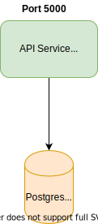

*If you haven't read my previous post on [how to use Docker for local development](/docker-local-environment/). I highly recommend you read it before this.*

At Anyfin, we have completely embraced docker for both local development environment and production deployments. Using Docker in local development allows us to maintain a consistent environment on everyone's machine irrespective of their installed OS or dependencies. Hence, if we were to bump up a dependency like Node.js version for a service it propagates to all the developers when they do a git pull.

To explain it better, let's take an example.

## Example

Let's say we have a backend Node.js service called **api-service** which depends on postgres database.




A typical setup would have three parts:

- The application source code.
- A Dockerfile for building our production app.
- A docker-compose file for local dev setup. This will help us spin up both the service and a postgres instance.

The folder structure can look something like this:

```js
.
├── api
│   ├── README.md
│   ├── index.js
│   ├── package-lock.json
│   ├── package.json
│   ├── Dockerfile.development // development docker file
│   └── Dockerfile // production docker file
└── docker-compose.yml

```

`docker-compose.yml`
```yml
version: '3.8'
volumes:
  postgres-data:
services:
  api:
    build:
      context: "./api"
      dockerfile: "Dockerfile.development"
  
    command: sh -c "yarn install && yarn start"
    environment:
      - NODE_ENV=development
      - PORT=5000
      - DATABASE_LOGIN_URL=postgres://postgres:secret@db/postgres
    ports:
      - '5000:5000'
    working_dir: /root/app
    volumes:
      - ./api:/root/app:cached # <--- This will map ./api to /root/app inside the container.
  db:
    image: postgres:13
    volumes:
      - postgres-data:/var/lib/postgresql/data:delegated
    environment:
      - POSTGRES_USER=postgres
      - POSTGRES_PASSWORD=secret
    ports:
      - 5432:5432

```

`./api/Dockerfile.development` - development docker image
```c
FROM node:16-alpine

# Some extra deps. For example graphicsmagick for a npm module like gm
RUN apk add --update graphicsmagick

```

`./api/Dockerfile` - production docker image
```c
FROM node:16-alpine

# Some extra deps. For example graphicsmagick for a npm module like gm
RUN apk add --update graphicsmagick

# Create a work directory
WORKDIR /home/node/app

COPY package.json yarn.lock ./

RUN yarn install --production

COPY . .

CMD ["node", "index.js"]
```


In order to run locally we would do:

```sh
docker-compose up api
```

and for building production docker image we could do

```sh
cd api
docker build . -t api:latest
```

## Issues with this approach

We were using this setup for a while but over time we realised that anytime we update a dependency we have to update both Dockerfiles.
This was manual and if not done properly could lead to us using different dependencies for development and production.
Hence, we tried to merge both the Dockerfiles into one.


## Multi stage Dockerfiles to the rescue

Multi stage Dockerfile has multiple stages inside the same Dockerfile. This implies that we can have multiple docker images from the same Dockerfile.

With multi stage dockerfile our setup will now only have a single Dockferfile for both production build and local development.

`./api/Dockerfile`
```c
# base image contains the dependencies and no application code
FROM node:16-alpine as base  

RUN apk add --update graphicsmagick

# prod image inherits from base and adds application code
FROM base as prod 

WORKDIR /home/node/app
COPY package.json yarn.lock ./
RUN yarn install --production
COPY . .

CMD ["node", "index.js"]

```

And we will now change our docker-compose file to:

`docker-compose.yml`

```diff

version: '3.8'
volumes:
  postgres-data:
services:
  api:
   build:
     context: "./api"
-    dockerfile: "Dockerfile.development"
+    target: "base"   # We specify which stage of the dockerfile to use
    command: sh -c "yarn install && yarn start"
    environment:
      - NODE_ENV=development
      - PORT=5000
      - DATABASE_LOGIN_URL=postgres://postgres:secret@db/postgres
    ports:
      - '5000:5000'
    working_dir: /root/app
    volumes:
      - ./api:/root/app:cached
  db:
    image: postgres:13
    volumes:
      - postgres-data:/var/lib/postgresql/data:delegated
    environment:
      - POSTGRES_USER=postgres
      - POSTGRES_PASSWORD=secret
    ports:
      - 5432:5432 

```


In order to run locally we would do:

```sh
docker-compose up api
```

and for building production docker image we could do

```sh
cd api
docker build . -t api:latest
```


This way each service can just specify one single Dockerfile and we could reuse it for both development and production 🚀

In a future post I will cover on how we could use multi stage dockerfile to keep our production image sizes down.