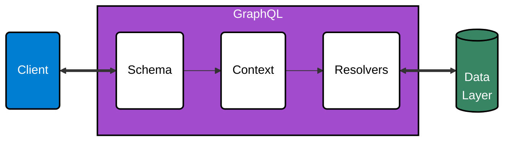

GraphQL is a great way to build strongly typed, self documenting applications. One of the key concepts in GraphQL is that the server provides a single endpoint where it exposes all the data in a graph like structure that the clients can request from.
Hence, our application needs to control who (authentication) can see and interact with what parts (authorization) of the data it provides.

There are multiple ways to introduce authentication and authorization into our GraphQL application. In this post we will be design our GraphQL application security with the following characteristics:

- **Declarative** - We define all the access control rules in the schema itself. This makes it easier to understand and maintain the access declaratively as the schema evolves. Effectively, our schema also becomes the source of truth for the access control rules.
- **Role based access control (RBAC)** - Allow users to access different parts of the data based on their role.
- **Deny first and explicit authorization** - Following the principle of least privilege, we would like to deny access to fields that are not explicitly authorized. This is a good way to prevent accidental access to sensitive data.

These could be implemented in any language that supports GraphQL. In this post, we will be using [Apollo](https://www.apollographql.com/) to see how we can implement these concepts.

# Authentication

> **Authentication** is determining if a given user is logged in, and subsequently determining who the user is.

Typically, when a request comes in, it goes through the following layers inside a typical GraphQL server:



- **Schema**: The schema layer parses the GraphQL query and determines if the query is valid.
- **Context**: The context layer is responsible for setting up a context object that is passed to all the resolvers of the query. A new context is created for every request.
- **Resolvers**: The resolvers layer contain the business logic to fetch and transform data to be returned to the client.

<br/>

Since GraphQL is unopinionated about the authentication process, we can implement authentication at various stages of the request lifecycle. But ideally, we should be authenticating our users as early as possible. We could also use many different authentication methods, such as JWT, OpenID Connect, etc. Here, we will not cover these methods but focus on GraphQL.

Lets take few scenarios.

## apollo-server (Apollo Server)

If you are using the standalone Apollo Server to run your application, you could authenticate the user in the context layer like so:

```js
import { ApolloServer } from 'apollo-server';

const server = new ApolloServer({
  typeDefs,
  resolvers,
  context: ({ req }) => {
    // Get the user token from the headers.
    const token = req.headers.authorization || '';

    // Try to retrieve a user with the token
    const user = getUser(token);

    // The resolvers can now access the user via the context
    return { user };
  },
});

server.listen().then(({ url }) => {
  console.log(`🚀 Server ready at ${url}`);
});
```

## apollo-server-express (Apollo Server Express)

In the case of Apollo Server with Express or similar, you can authenticate the user even before the request reaches the apollo server.
Hence, here if the jwt is expired we could return early with a 401 error to the client.

```js
import { ApolloServer, gql } from 'apollo-server-express';
import express from 'express';
import { expressjwt } from 'express-jwt';

async function startApolloServer(typeDefs, resolvers) {
  const app = express();

  // 1. Authenticate the user before passing request to apollo server
  app.use(
    expressjwt({
      secret: 'jwt-secret',
      credentialsRequired: false,
      algorithms: ['HS256'],
    })
  );

  const server = new ApolloServer({
    typeDefs,
    resolvers,
    context: ({ req }) => ({
      // 2. Map the authenticated user from express to the context
      user: req.auth,
    }),
  });

  await server.start();
  server.applyMiddleware({ app });

  app.listen({ port: 3000 }, () =>
    console.log(`🚀 Server ready at http://localhost:3000${server.graphqlPath}`)
  );
}

await startApolloServer(typeDefs, resolvers);
```

## Infrastructure layer

We could also go one step further and authenticate the user even before the request reaches our application. Maybe at the nginx / loadbalancer level.

# Authorization

> **Authorization** is determining what a given user has permission to do or see.

After a request is authenticated and the user is known, we can determine what the user has access to.

## Basic all or nothing approach

In the initial stages of building our GraphQL application, the most basic approach we can do is deny unauthorized or users with incorrect roles the ability to execute a query at all. Since this is an all or nothing approach, it could also be used in highly restrictive environments that provide no publicly accessible fields or like an internal tool or an independent microservice that shouldn't be exposed to the public.

```js
context: ({ req }) => {
  // try to retrieve a user with the token
  const user = getUser(req);

  // Block if non authenticated users should not be allowed to access any data
  if (!user) {
    throw new AuthenticationError('you must be logged in');
  }

  // Also check user roles/permissions inside the retrieved user here
  if (!user.roles.includes('admin')) {
    throw new ForbiddenError('you must be an admin');
  }
  // add the user to the context
  return { user };
};
```

## Role based access control or RBAC

Typically as the project grows we would have users with different roles. For example, we could have users with roles such as **employee**, **customer**, **guest** or even other **services** etc. The basic all or nothing approach would then not be able to cut it. Along with users with different roles, we would also have growing types of data with different access requirements.

In order to support role based access to different parts of our GraphQL schema (and hence different types of data), we can think about authorization in terms of **roles** and **permissions**.

### Roles

Roles are identifiers assigned to different users of the application to restrict their access. For example, we can assign an employee the role **employee** and a customer the role **customer**. In practice, this could also be more complex with users having multiple roles like **["employee", "roles-editor"]** or **["employee-readonly", "billing-manager"]**, etc.

if we are using JWTs for auth then we could even assign them as part of the payload of a user's jwt token:

```json
{
  "username": "hawkeye",
  "type": "employee",
  "roles": ["employee", "roles-editor"],
  "iat": 1654104898,
  "exp": 1656696898
}
```

### Permissions

Permissions are identifiers assigned to different groups of data in your application. We would assign permissions to each field in the GraphQL schema to mark its access requirements. The idea is to use a **@auth** GraphQL schema directive to annotate permissions for each field (We will look at **@auth**'s implementation in a bit).

For example, consider a GraphQL schema with the following **@auth** anotations:

```graphql
directive @auth(permissions: [String!]) on FIELD_DEFINITION

type Query {
  # Should only be accessible by employees with read access to customer data
  customers: [Customer] @auth(permissions: ["customer:read"])

  # Should only be accessible only to the currently logged in customer
  me: Customer @auth(permissions: ["self:customer"])
}

type Mutation {
  # Should be accessible to all users
  login(username: String!): AccessToken!

  # Should only be accessible by employees with write access to customer data
  updateCustomer(customerId: ID!, name: String): Customer
    @auth(permissions: ["customer:write"])

  # Should only be accessible to an employee with higher privileges
  updateEmployeeRole(employeeId: ID!, role: String): Boolean
    @auth(permissions: ["iam:write"])
}

type AccessToken {
  token: String
}

type Customer {
  id: ID
  username: String
  internalNote: String @auth(permissions: ["notes:read"])
}
```

Here, each field has a permission assigned to it. There are few scenarios here:

- **customers** field should only be accessible to users with the permission `customer:read`.
- **me** field should only be accessible to the currently logged in customer. Here we annotated the field with a `self:customer` permission. This could be any string, but in our auth system, lets consider this to be a special purpose permission which would only be assigned to the customers. Hence, any field annotated with `self:customer` will only be accessible to the currently logged in customer and not to any other user.
- **login** mutation has no permissions assigned to it and hence it should be accessible to all users
- **updateCustomer** mutation should only be accessible to employees with the permission `customer:write`.
- **updateEmployeeRole** mutation should only be accessible to certain employees with higher privileges (with the permission `iam:write`).
- **Customer.internalNotes** field should only be accessible to employees with the permission `notes:read` and not to the customer too. It also shows, that we should be able to restrict access at any level of the GraphQL schema.

### Linking roles and permissions

Now in order to link roles to these permissions, we can think of roles as a _collection_ of permissions.
Extending the previous example, the mapping of roles to permissions could look like this:

```json
{
  "anonymous": {
    "permissions": []
  },
  "customer": {
    "permissions": ["self:customer"]
  },
  "employee": {
    "permissions": ["customer:read", "customer:write", "notes:read"]
  },
  "employee-readonly": {
    "permissions": ["customer:read", "notes:read"]
  },
  "roles-editor": {
    "permissions": ["iam:write"]
  },
  "profile-service": {
    "permissions": ["customer:read"]
  }
}
```

Here,

- **anonymous** role has no permissions assigned to it. This could be the default role for all users. Hence they would only have access to the public fields.
- **customer** role could have only the special purpose permission **self:customer** assigned to it. This way they would only have access to fields marked with **self:customer**.
- We could also have multiple roles assigned to a user. For example an employee could have read only access with **employee-readonly** role, while another employee could have higher privilege with roles such as **employee** and **roles-editor**.
- **profile-service** Another use case of the roles system could be to provide access to other interal / external services to only certain parts of the GraphQL schema. Here, if we imagine a hypothetical **profile-service** that would have the role **profile-service**. With this role, it would only have read access to the customer data since it only has **customer:read** permission.

Separating roles and permissions provides us with a lot of flexibility in managing role based access to our GraphQL schema.
Roles reflect the type of users in the business while permissions usually are closer to the type of data we have.
Both roles and permissions evolve independently over time as the type of users and data grows. Hence, as we scale our application, the roles-permission mapping enables us to have a fine grained and granular access control mechanism for our data and users.

# Implementation of @auth

## Field level authorization

As mentioned above, for authorization, we will be using the **@auth** schema directive to annotate permissions for each field. A schema directive in GraphQL decorates part of the GraphQL schema with additional configuration in order to add custom functionality. More details about directives here: https://www.apollographql.com/docs/apollo-server/schema/directives/

Our aim is to implement a **@auth** schema directive to perform authorization on a field before our query is executed by its resolvers.

In order to implement a schema directive for fields we will first need to declare it in our schema.
Once declared, we can then go ahead and annotate our fields with the **@auth** directive.

```graphql
# Definition
directive @auth(permissions: [String!]) on FIELD_DEFINITION

type Query {
  # Usage
  customers: [Customer] @auth(permissions: ["customer:read"])
}
```

In order to implement @auth directive's functionality, we would need to perform the following steps:

- Parse the GraphQL schema and walk through each field
- When we encounter a field with **@auth** directive, we will replace the field's resolver with a custom resolver.
- The custom resolver's job would be to check if a user has the required permissions and if they do, call the field's original resolver and return the result. If the user doesn't have the required permissions, we would throw an error.

### Code

We would need to install the following packages:

```
npm install @graphql-tools/schema @graphql-tools/utils
```

Next, lets create a `getAuthorizedSchema` function that will take a GraphQL schema as input and return a new schema with the **@auth** directive implemented.

**src/graphql/directives.js**

```js
import { mapSchema, getDirective, MapperKind } from '@graphql-tools/utils';

export function getAuthorizedSchema(schema) {
  const authorizedSchema = mapSchema(schema, {
    // Executes once for each object field definition in the schema
    [MapperKind.OBJECT_FIELD]: (fieldConfig) => {
      // 1. Try to get the @auth directive config on the field
      const fieldAuthDirective = getDirective(schema, fieldConfig, 'auth')?.[0];

      // 2. If a @auth directive is found, replace the field's resolver with a custom resolver
      if (fieldAuthDirective) {
        // 2.1. Get the original resolver on the field
        const originalResolver = fieldConfig.resolve ?? defaultFieldResolver;
        // 2.2. Replace the field's resolver with a custom resolver
        fieldConfig.resolve = (source, args, context, info) => {
          const user = context.user;
          const fieldPermissions = fieldAuthDirective.permissions;
          if (!isAuthorized(fieldPermissions, user)) {
            // 2.3 If the user doesn't have the required permissions, throw an error
            throw new ForbiddenError('Unauthorized');
          }
          // 2.4 Otherwise call the original resolver and return the result
          return originalResolver(source, args, context, info);
        };
      }
      return fieldConfig;
    },
  });
  return authorizedSchema;
}
```

where `isAuthorized` function would check if the user has the required permissions for the field.

```js
function isAuthorized(fieldPermissions, user) {
  const userRoles = user?.roles ?? [];
  const userPermissions = new Set();
  // 1. Expand user roles to permissions
  userRoles.forEach((roleKey) => {
    const role = RolePermissions[roleKey] ?? RolePermissions.anonymous;
    role.permissions?.forEach((permission) => userPermissions.add(permission));
  });

  // 2. Check if atleast one of the user's permissions matches that of required for accessing the field
  for (const permission of fieldPermissions) {
    if (userPermissions.has(permission)) {
      return true;
    }
  }
  return false;
}
```

Now we can use the `getAuthorizedSchema` function just before apollo server is created:

```js
async function startApolloServer(typeDefs, resolvers) {
  // Create the base executable schema
  let schema = makeExecutableSchema({ typeDefs, resolvers });

  // Transform the schema by applying directive logic
  schema = getAuthorizedSchema(schema);

  // Provide the transformed schema to the ApolloServer constructor
  const server = new ApolloServer({
    schema,
    context: ({ req }) => ({
      user: req.auth,
    }),
  });

  await server.start();

  server.listen().then(({ url }) => {
    console.log(`🚀 Server ready at ${url}`);
  });
}

await startApolloServer(typeDefs, resolvers);
```

### Code link

> Complete working code till here can be found at:
>
> https://github.com/a7ul/blog-graphql-auth-example under the tag **field-auth**
>
> ```
> git clone https://github.com/a7ul/blog-graphql-auth-example
> cd blog-graphql-auth-example
> git checkout field-auth
> ```
>
> or visit https://github.com/a7ul/blog-graphql-auth-example/tree/field-auth

## Type level authorization

At first glance, field level authorization seems to be a great approach. However, it is not enough to completely protect our GraphQL schema. Since GraphQL schema is a tree, it could be possible to access the same information via multiple paths.

For example, consider the following schema:

```graphql
type Query {
  # Should only be accessible by employees with read access to customer data
  customers: [Customer] @auth(permissions: ["customer:read"])

  # Should only be accessible only to the currently logged in customer
  me: Customer @auth(permissions: ["self:customer"])

  # Should only be accessible by employees with read access to invoice data
  getCustomerInvoices(customerId: ID!): [Invoice]
    @auth(permissions: ["invoice:read"])
}

type Customer {
  id: ID
  username: String
  name: String
  invoices: [Invoice]
  internalNote: String @auth(permissions: ["notes:read"])
}

type Invoice {
  id: ID!
  customerId: ID!
  amount: Float!
}
```

Here, we want to only allow users with permission **invoice:read** to access the customer invoices. To do so we added a field level authorization directive **@auth(permissions: ["invoice:read"])** to our query **getCustomerInvoices**.

But, the invoice for a customer is also exposed via the type Customer's **invoices** field. Hence, a user with **customer:read** can read a customer's invoice even if they dont have the **invoice:read** permission via the query

```graphql
query {
  customers {
    id
    invoice {
      id
      amount
    }
  }
}
```

A quick fix for this issue would be to add a **@auth** directive to the type Customer's **invoices** field. But, this feels like we have to manually keep track of new fields that are added to the schema and add **@auth** to block access. This is error prone and can cause accidental leaks. Ideally, our auth system should be designed in a way that it prevents this behaviour by default.

**The solution** to this problem is to make it possible to add a **@auth** directive at the **type level**.

We could add **@auth** to the type **Invoice**

```graphql
type Query {
  # Should only be accessible by employees with read access to customer data
  customers: [Customer] @auth(permissions: ["customer:read"])

  me: Customer @auth(permissions: ["self:customer"])

  # Should only be accessible by employees with read access to invoice data
  getCustomerInvoices(customerId: ID!): [Invoice]
    @auth(permissions: ["invoice:read"])
}

type Customer {
  id: ID
  username: String
  name: String
  invoices: [Invoice]
  internalNote: String @auth(permissions: ["notes:read"])
}

# Now the fields of Invoice require `invoice:read` permission by default
type Invoice @auth(permissions: ["invoice:read"]) {
  id: ID!
  customerId: ID!
  amount: Float!
}
```

By adding **@auth to the type Invoice**, we are saying that by default all the fields of the type **Invoice** will be accessible only to users with permission **invoice:read**. Hence, even if you a user can read the type **Invoice**, they will not be able to read the fields of the the type if they dont have the permission **invoice:read**.

Both of these are essentially equivalent:

```graphql
type Invoice @auth(permissions: ["invoice:read"]) {
  id: ID!
  customerId: ID!
  amount: Float!
}
```

and

```graphql
type Invoice {
  id: ID! @auth(permissions: ["invoice:read"])
  customerId: ID! @auth(permissions: ["invoice:read"])
  amount: Float! @auth(permissions: ["invoice:read"])
}
```

### Code

In order to allow **@auth** directive to be specified at the type level we need to change its declaration in the schema as follows:

```graphql
# Definition
directive @auth(permissions: [String!]) on FIELD_DEFINITION | OBJECT

type Query {
  # Usage: field level
  getCustomerInvoices(customerId: ID!): [Invoice]
    @auth(permissions: ["invoice:read"])
}

# Usage: type level
type Invoice @auth(permissions: ["invoice:read"]) {
  id: ID!
  customerId: ID!
  amount: Float!
}
```

Next, before we modify our `getAuthorizedSchema` function to support **@auth** directive at the type level,

let add a new function `gatherTypePermissions` which will parse through the schema and return a map of types and their permissions.

**src/graphql/directives.js**

```js
function gatherTypePermissions(schema) {
  // 1. Create a map to store a type and its permissions
  const typePermissionMapping = new Map();
  mapSchema(schema, {
    // 2. Executes once for each type definition in the schema
    [MapperKind.OBJECT_TYPE]: (typeConfig) => {
      const typeAuthDirective = getDirective(schema, typeConfig, 'auth')?.[0];
      const typeLevelPermissions = typeAuthDirective?.permissions ?? [];
      // 3. Collect permissions for each type
      typePermissionMapping.set(typeConfig.name, typeLevelPermissions);
      return typeConfig;
    },
  });
  return typePermissionMapping;
}
```

Now, lets modify `getAuthorizedSchema` to use the type level permissions.

```diff
export function getAuthorizedSchema(schema) {
+  const typePermissionMapping = gatherTypePermissions(schema);
+
   const authorizedSchema = mapSchema(schema, {
     // Executes once for each object field definition in the schema
-    [MapperKind.OBJECT_FIELD]: (fieldConfig) => {
+    [MapperKind.OBJECT_FIELD]: (fieldConfig, fieldName, typeName) => {
       // 1. Try to get the @auth directive config on the field
       const fieldAuthDirective = getDirective(schema, fieldConfig, "auth")?.[0];
+      // 1.1 Get the permissions for the field
+      const fieldPermissions = fieldAuthDirective?.permissions ?? [];
+      // 1.1 Get the permissions for the field's type
+      const typePermissions = typePermissionMapping.get(typeName) ?? [];

       // 2. If a @auth directive is found, replace the field's resolver with a custom resolver
-      if (fieldAuthDirective) {
+      if (fieldPermissions.length > 0 || typePermissions.length > 0) {
         // 2.1. Get the original resolver on the field
         const originalResolver = fieldConfig.resolve ?? defaultFieldResolver;
         // 2.2. Replace the field's resolver with a custom resolver
         fieldConfig.resolve = (source, args, context, info) => {
           const user = context.user;
-          const fieldPermissions = fieldAuthDirective.permissions;
-          if (!isAuthorized(fieldPermissions, user)) {
+          if (!isAuthorized(fieldPermissions, typePermissions, user)) {
             // 2.3 If the user doesn't have the required permissions, throw an error
             throw new ForbiddenError("Unauthorized");
           }
```

and finally add support for **typePermissions** to **isAuthorized** function.

```diff
-function isAuthorized(fieldPermissions, user) {
+function isAuthorized(fieldPermissions, typePermissions, user) {
   const userRoles = user?.roles ?? [];
   const userPermissions = new Set();
   // 1. Expand user roles to permissions
@@ -18,25 +18,55 @@ function isAuthorized(fieldPermissions, user) {
       return true;
     }
   }
+
+  // 3. if there are no field permissions then check if the type has permissions
+  if (fieldPermissions.length === 0) {
+    for (const typePermission of typePermissions) {
+      if (userPermissions.has(typePermission)) {
+        return true;
+      }
+    }
+  }
   return false;
 }

```

Now the following query should return unauthorized error for a user with only `customer:read` and no `invoice:read` permission, since the invoice fields now required `invoice:read` permission.

```graphql
query {
  customers {
    id
    invoice {
      id
      amount
    }
  }
}
```

> ### Side note
>
> The type level **@auth** directive is for assigning default permissions to the fields of a type but if needed we could always override the permissions for a field of a type by adding a field level **@auth** directive.
>
> Example:
>
> ```graphql
> type Invoice @auth(permissions: ["invoice:read"]) {
>   id: ID!
>   customerId: ID!
>   amount: Float!
>   signedBy: Admin @auth(permissions: ["admin:read"])
> }
> type Admin {
>   id: ID!
>   name: String
> }
> ```
>
> Here all fields of the type **Invoice** will have the default **invoice:read** permission but the field **signedBy** will only have **admin:read** permission.

### Code link

> Complete working code till here can be found at:
>
> https://github.com/a7ul/blog-graphql-auth-example under the tag **type-auth**
>
> ```
> git clone https://github.com/a7ul/blog-graphql-auth-example
> cd blog-graphql-auth-example
> git checkout type-auth
> ```
>
> or visit https://github.com/a7ul/blog-graphql-auth-example/tree/type-auth

## Deny first and explicit authorization

With type + field level authorization, we now get a lot of control over managing access to the data graph. But in the current approach we consider a field without an **@auth** directive as **publicly accessible**. This approach is essentially a blocklist approach, ie, we are blocking access by adding **@auth**. But, following the principle of least privilege, we should be doing the reverse. We should be denying access to fields by default and only open up access if a field has an **@auth** directive specified. This way our auth system would automatically prevent fields that were accidentally exposed without a **@auth** directive. And if we need few fields to be public we could annotate those fields with a special permission (For example: **@auth(permissions: ['self:anyone'])**) so that our **@auth** directive can skip authorization on. This way as the schema grows, we can be explicit about and keep track of these publicly accessible fields along with avoiding unintentional leaks.

Lets take an example to understand this better:

**Schema without explicit deny first approach** ❌

```graphql
type Query {
  # Missed adding an @auth for custoers query accidentally,
  # but now its public by default and is sensitive
  # This is bad ❌
  customers: [Customer]
  # Public health query - this is public by default
  # and its okay since its non sensitive ✅
  health: String
  me: Customer @auth(permissions: ["self:customer"]) ✅
}
```

**vs**

**Schema with explicit DENY-FIST approach** ✅

```graphql
type Query {
  # Missed adding an @auth for customers query accidentally,
  # but now its denied by default so its not accessible to anyone
  # This is good since it prevented accidental leak ✅
  customers: [Customer]
  # Public health query - Since we added @auth here and
  # explicitly marked it as publicly accessible with self:anyone,
  # its accessible ✅
  health: String @auth(permission: ["self:anyone"])
  me: Customer @auth(permissions: ["self:customer"]) ✅
}
```

### Code

In order to implement a deny first approach we need to make minor tweaks to our **getAuthorizedSchema** function.

But before that lets add a new helper function **shouldDenyByDefault** that will return true if the field is not explicitly authorized.

```js
function shouldDenyFieldByDefault(fieldPermissions, typePermissions) {
  // Check if a field has either field or type permissions
  // If no, then return true (meaning deny this field)
  const hasNoPermissions =
    fieldPermissions.length === 0 && typePermissions.length === 0;
  return hasNoPermissions;
}
```

Next we modify the **getAuthorizedSchema** function to check if the field is explicitly authorized.

```diff
 export function getAuthorizedSchema(schema) {
   const typePermissionMapping = gatherTypePermissions(schema);

@@ -56,9 +63,21 @@ export function getAuthorizedSchema(schema) {
       const fieldAuthDirective = getDirective(schema, fieldConfig, "auth")?.[0];
       // 1.1 Get the permissions for the field
       const fieldPermissions = fieldAuthDirective?.permissions ?? [];
       // 1.2 Get the permissions for the field's type
       const typePermissions = typePermissionMapping.get(typeName) ?? [];

+      // 1.3 Check if field should be denied by default
+      if (shouldDenyFieldByDefault(fieldPermissions, typePermissions)) {
+        // Replace, the resolver with a ForbiddenError throwing function.
+        // Optionally log here so it shows up while the server starts
+        fieldConfig.resolve = () => {
+          throw new ForbiddenError(
+            `No access control specified for ${typeName}.${fieldName}. Deny by default`
+          );
+        };
+        return fieldConfig;
+      }
+
       // 2. If a @auth directive is found, replace the field's resolver with a custom resolver
       if (fieldPermissions.length > 0 || typePermissions.length > 0) {
         // 2.1. Get the original resolver on the field

```

Now for this schema, if we make

```graphql
type Query {
  # Missed adding an @auth for customers query accidentally here
  customers: [Customer]

  # Public health query - should be publicly accessible
  # explicitly marked it as publicly accessible with self:anyone,
  health: String @auth(permission: ["self:anyone"])
  me: Customer @auth(permissions: ["self:customer"])
}
```

Then the following query will fail with a ForbiddenError since its now deny by default.

```graphql
query {
  customers {
    id
  }
}
```

Sweet! But we have a slight problem. Now if we try to make a query like so

```graphql
query {
  health
}
```

Then the following query also fails with a **ForbiddenError** even though we marked it with **@auth(permission: ["self:anyone"])**.
This is because our **@auth** directive doesnt know yet that it has to allow access to any field / type marked with **@auth(permission: ["self:anyone"])**.

Lets fix that by modifying our **isAuthorized** function.

```diff
 function isAuthorized(fieldPermissions, typePermissions, user) {
   const userRoles = user?.roles ?? [];
-  const userPermissions = new Set();
+  // Add self:anyone to user permissions by default
+  const userPermissions = new Set(["self:anyone"]);
   // 1. Expand user roles to permissions
   userRoles.forEach((roleKey) => {
     const role = RolePermissions[roleKey] ?? RolePermissions.anonymous;
@@ -46,6 +47,12 @@ function gatherTypePermissions(schema) {
   return typePermissionMapping;
 }
```

### Caveats to deny by default approach

- **Deny by default approach is applied to all types and fields irrespective of whether they are top level types or not**.
  Lets take the following schema as an example

  ```graphql
  type Mutation {
    # Should be accessible to all users
    login(username: String!): AccessToken! @auth(permissions: ["self:anyone"])
  }

  type AccessToken {
    token: String
  }
  ```

  If we now make the following query

  ```graphql
  mutation {
    login(username: "test") {
      token
    }
  }
  ```

  We would expect that the query would succeed since we explicitly marked the mutation with **self:anyone**.
  But it should fail because the mutation returns a type **AccessToken** whose field dont have any permissions. So the fields of the AccessToken type are also denied by default.

  To fix this we add a **@auth(permission: ["self:anyone"])** to the AccessToken type like so.

  ```diff
  -type AccessToken {
  +type AccessToken @auth(permissions: ["self:anyone"]) {
     token: String
   }
  ```

- **We should skip internal apollo types otherwise our directive will deny them too by default**.
  Apollo has some types and fields that it uses internally. For example, **\_\_typename**, **\_entities**, **\_service**, etc
  We should skip these types and fields from our **@auth** directive

  To skip these we can make the following change to **shouldDenyFieldByDefault** function:

  ```diff
  -function shouldDenyFieldByDefault(fieldPermissions, typePermissions) {
  +function shouldDenyFieldByDefault(
  +  fieldPermissions,
  +  typePermissions,
  +  fieldName,
  +  typeName
  +) {
  +  if (fieldName.startsWith("_") || typeName.startsWith("_")) {
  +    // Apollo's internal fields / types start with _
  +    return false;
  +  }
     const hasNoPermissions =
       fieldPermissions.length === 0 && typePermissions.length === 0;
     return hasNoPermissions;
  ```

### Code link

> Complete working code till here can be found at:
>
> https://github.com/a7ul/blog-graphql-auth-example under the tag **deny-by-default**
>
> ```
> git clone https://github.com/a7ul/blog-graphql-auth-example
> cd blog-graphql-auth-example
> git checkout deny-by-default
> ```
>
> or visit https://github.com/a7ul/blog-graphql-auth-example/tree/deny-by-default

# Summary

GraphQL is a really powerful tool for building apis that are versionless and well documented. As we introduce more types and fields to our schema, we need to make sure that we do so in a secure way. The **@auth** directive in this post allows us to introduce security with to our schema with following characteristics:

- **Declarative** - We can use our schema as a documentation and source of truth for authorization.
- **Flexible** - Type and field permissions allows us to introduce RBAC with ease without sacrificing DX.
- **Deny first and explicit authorization** - Follows the principle of least privilege, so we deny access to fields that are not explicitly authorized in order to prevent accidental access to sensitive data.

> The entire code for this post can be found at: https://github.com/a7ul/blog-graphql-auth-example

# References

- https://www.apollographql.com/docs/apollo-server/security/authentication/
- https://www.apollographql.com/docs/apollo-server/schema/creating-directives
