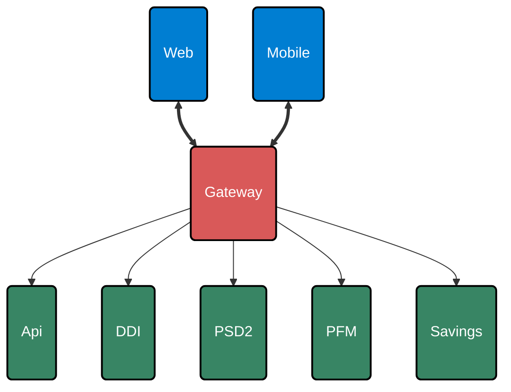
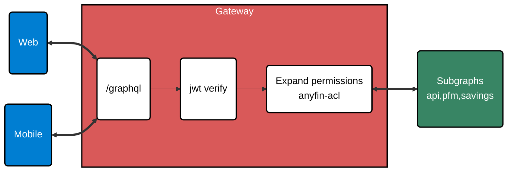
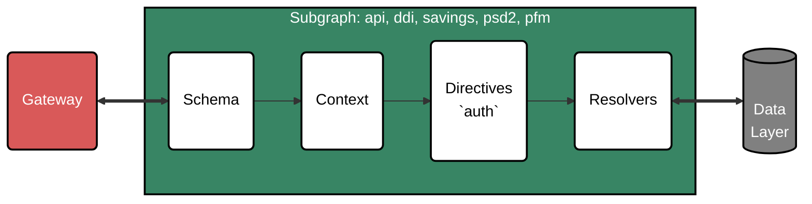

```json
Token ( JWT ): Bearer eyJhbGciOiJIUzI1NiIsInR5cCI6IkpXVCJ9.eyJpZCI6ImU4OZm…………YorfRxm8
```

<div>

```json
{
  "id": "e8988f90-6fef-11e9-9d75-b7a0d0de610a",
  "name": "Atul Ramachandran",
  "type": "admin",
  "roles": ["employee:readonly", "payment-admin"],
  "iat": 1654104898,
  "exp": 1656696898,
  "sub": "e8988f90-6fef-11e9-9d75-b7a0d0de610a"
}
```

```json
// Body of the request
{
  "query": "query GetUser{ user { id } }",
  "variables": {},
  "extensions": {
    "user": {
      "id": "e8988f90-6fef-11e9-9d75-b7a0d0de610a",
      "name": "Atul Ramachandran",
      "type": "admin",
      "roles": ["employee:readonly", "payment-admin"],
      "permissions": [
        "admin:list",
        "admin:self",
        "agreement:list",
        "application:list",
        "application:read:all",
        "cash-advance:read:all",
        "customer:impersonate",
        "customer:list",
        "customer:read:all",
        "identity:list",
        "lender:list"
      ]
    }
  }
}
```

</div>


