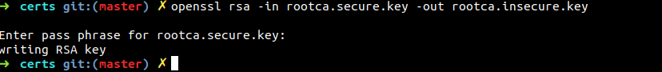
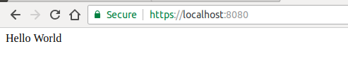

Recently, Google security blog published an article [here](https://security.googleblog.com/2018/02/a-secure-web-is-here-to-stay.html) which states:
> Beginning in July 2018 with the release of Chrome 68, Chrome will mark all HTTP sites as “not secure”.

Google has been pushing for HTTPS for sometime now. A blog post in 2014 [here](https://webmasters.googleblog.com/2014/08/https-as-ranking-signal.html) tells us that Google's search engine ranks HTTPS websites over unsecure HTTP websites.

While more and more websites and apps are becoming HTTPS enabled, we still develop these web apps on our local development environment over HTTP.
Since web browsers behave slighlty differently when serving HTTPS and HTTP website, this can lead to few issues when we deploy to production.

One such issue is mixed content because some of the resource might be loaded using HTTP on a HTTPS site.  [More on mixed content here](https://developers.google.com/web/fundamentals/security/prevent-mixed-content/what-is-mixed-content)


Issues like these can be prevented by using HTTPS on development machine (localhost).
Also, enabling HTTPS on the development version would allow it to be much more closer to the production version of the web app and hence would allow you to catch those bugs which would only show up after you deploy. 

## Overview of SSL Certificate generation process


## Setup local HTTPS development environemt

*PS: Although this guide is for linux and Mac OS, Windows users can run equivalent commands and achieve the same result.*   

### Step 1: Creating a Certificate Signing Request

Certificate Signing Request (CSR) is a message or block of encoded text sent from an applicant to a Certificate Authority (CA) in order to apply for a SSL Certificate. CSR usually contains all the information that needs to be stored in the SSL Certificate such as the organization name, common name (domain name), locality, and country along with public key of the applicant.

In short:  CSR = (Some Information for Certificate) + (Public Key of applicant) 

A certificate authority (CA) will use a CSR to create your SSL certificate.
Hence, we need a public key to proceed with generation of CSR, so lets create that first.

**Creating the private/public key pair** 

```bash
openssl genrsa -des3 -out localdomain.secure.key 2048
```
Enter a password when prompted. I will be using password as "password" for the sake of demo.
This will generate a file `localdomain.secure.key`. The generated `localdomain.secure.key` is a password protected container which has both private and public keys (essentially a key pair).

For the ease of learning we will remove the password protection in the next step.
```bash 
openssl rsa -in  localdomain.secure.key -out localdomain.insecure.key
```
This will generate a file `localdomain.insecure.key` which is essentially our key pair without password protection. *You can also continue using the password protected `localdomain.secure.key` in place of the `localdomain.insecure.key` only thing you will be asked to enter the password for each command.*

**Creating a Certificate Signing Request**

We will be generating a CSR for `localhost`. To do so we will first create a configuration file which will have all the information that needs to be sent to the CA.

Create a configuration file for our localhost domain (`localdomain.csr.cnf`):
```
[req]
default_bits = 2048
prompt = no
default_md = sha256
distinguished_name = dn

[dn]
C=IN
ST=SomeState
L=SomeCity
O=SomeOrganization
OU=SomeUnit
emailAddress=test@test.com
CN = localhost
```
Now run the following command to generate a csr from our key and configuration file:

```bash
openssl req -new -sha256 -nodes -out localdomain.csr -key localdomain.insecure.key -config localdomain.csr.cnf
```
You should now get a `localdomain.csr` file which can be sent to a CA for generating the SSL certificates for your domain.<br/>
**For production servers** send your CSR file to one of the CAs mentioned [here](https://en.wikipedia.org/wiki/Certificate_authority) <br/>
**For development purposes** we will generate our own Root SSL Certificate (CA Certificate) and use that to generate SSL certificates from our CSR file.   

### Step 2: Generating Root SSL Certificate (CA Certificate)

**Creating the public/private key pair**

To generate a self-signed certificate we need a public key much like when we were generating a CSR. Hence, like before we generate a new key for our CA Certificate.
```bash 
openssl genrsa -des3 -out rootca.secure.key 2048
```
Enter a password when prompted. I will be using password as "password" for the sake of demo.

This will generate a file `rootca.secure.key`. The generated `rootca.secure.key` is a password protected container which has both private and public keys (essentially a key pair).

For the ease of learning we will remove the password protection in the next step.
```bash 
openssl rsa -in rootca.secure.key -out rootca.insecure.key
```

This will generate a file `rootca.insecure.key` which is essentially our key pair without password protection. *You can also continue using the password protected `rootca.secure.key` in place of the `rootca.insecure.key` only thing you will be asked to enter the password for each command.*

*PS: Please do not use unsecure keys when generating certificates for production use. Issue with using unsecure key is that if you accidentally expose the key, all your certifiactes and services will also be vulnerable. But since we are using it for development purpose at this time. Lets go ahead and use unsecure keys.*

**Generating Root SSL Certificate (CA Certificate)**

Run the following command:
```bash
openssl req -new -x509 -nodes -key rootca.insecure.key -sha256 -out cacert.pem -days 3650
```


Enter all the information that is asked. I filled in all dummy values for now.<br/>
This will generate `cacert.pem` which is our Root SSL Certificate (CA). We will use `cacert.pem` along with `localdomain.csr`(our CSR file) to generate the required SSL Certificate for localhost.


### Step 3: Generating SSL Certificate for localhost

To create our localhost SSL certificate we will now create another configuration file `localdomain.v3.ext`

```
authorityKeyIdentifier=keyid,issuer
basicConstraints=CA:FALSE
keyUsage = digitalSignature, nonRepudiation, keyEncipherment, dataEncipherment
subjectAltName = @alt_names

[alt_names]
DNS.1 = localhost
```
We need to specify subhectAltName with the domain `localhost` as shown.

Finally, we will now use our CSR(`localdomain.csr`) + CA Certificate(`cacert.pem`) + CA Key + (`rootca.insecure.key`) + Configuration file(`localdomain.v3.ext`) to generate our `localdomain.crt`

Now run the command
```
openssl x509 -req -in localdomain.csr -CA cacert.pem -CAkey rootca.insecure.key -CAcreateserial -out localdomain.crt -days 500 -sha256 -extfile localdomain.v3.ext
```


If you check your directory now you will see a lot of files. Important files now to keep for next step are:
- CA/Root SSL Certificate: **cacert.pem**
- Domain Certificate: **localdomain.crt**
- Domain Key: **localdomain.insecure.key**


## How to use the SSL Certificates?

### Using the certificates in a NodeJS backend locally

`index.js`
```js
const https = require("https"); 
const fs = require('fs');
const path = require('path');

const port = 3000;

const certOptions = {
  key: fs.readFileSync(path.resolve('../localdomain.insecure.key')),
  cert: fs.readFileSync(path.resolve('../localdomain.crt'))
};
  
https.createServer(certOptions, (reqst, resp) => { 
    resp.writeHead(200, {'Content-Type': 'text/plain'}); 
    resp.end('Hello World Node!'); 
}).listen(port); 

console.log('Load https://localhost:' + port);
```

After this run `node index.js` and server should be running at
https://localhost:3000


### Using the certificates for a frontend only application

When developing frontend application we often use a development server to run the application and then access it via `localhost:xxxx`.
One such development server is `http-server` npm module.

```sh
mkdir project
cd project
npm install -g http-server
echo "Hello World" > index.html
http-server -a localhost --ssl --cert <path to>/localdomain.crt --key <path to>/localdomain.insecure.key
```


This runs the hello world index.html website in ssl mode in dev server.
Now open up https://localhost:8080.


## Importing  Root SSL Certificate (CA certificate) to the Browsers

Now if you open up the website at `https://localhost:xxxx` on Google Chrome or Firefox you should see an error message like this:


The error is `NET::ERR_CERT_AUTHORITY_INVALID` in chrome and `Error code: SEC_ERROR_UNKNOWN_ISSUER` in firefox. It means the browser is not able to trust the CA which issued this SSL certificate.
Hence to make our browser trust our own self signed CA Certificate (`cacert.pem`) we need to do the following:


### Importing Root SSL Certificate to Chrome

1. Type this in url bar of chrome and press enter. 
```
chrome://settings/certificates
```

2. Now go to the tab "Authorities". This contains all the CAs that browser trusts. We will import our CA (cacert.pem) into this.

3. Click on import. Choose the `cacert.pem` file.

4. Check the Trust this certificate for identifying websites checkbox and press OK. 
(If you scroll through the CA list you should see our CA at org-Testing or whatever you entered while generating it)

Now open up your development website again and it should show:



### Importing Root SSL Certificate to Firefox

1. Type this in url bar of firefox and press enter. 
```
about:preferences#privacy
```
2. Now scroll down to Certifiactes(under security) and click on "View Certifiactes".

3. Now go to the tab "Authorities". This contains all the CAs that browser trusts. We will import our CA (cacert.pem) into this.

3. Click on import. Choose the `cacert.pem` file.

4. Check the "Trust this CA  to identifying websites" checkbox and press OK. 
(If you scroll through the CA list you should see our CA at org-Testing or whatever you entered while generating it)

Now open up your development website again and it should show:


*PS: Use these certificates only for development.
These wont work in production as the certificate authority will not be trusted in your users browsers.
For production. generate a csr and then send it you CA and CA will generate a domain certificate for you.*


## References
- https://security.googleblog.com/2018/02/a-secure-web-is-here-to-stay.html
- https://support.google.com/webmasters/answer/6073543?hl=en
- https://webmasters.googleblog.com/2014/08/https-as-ranking-signal.html
- https://www.theregister.co.uk/2018/02/08/google_chrome_http_shame/
- https://help.ubuntu.com/lts/serverguide/certificates-and-security.html.en-GB
- https://medium.freecodecamp.org/how-to-get-https-working-on-your-local-development-environment-in-5-minutes-7af615770eec
- https://www.sslshopper.com/what-is-a-csr-certificate-signing-request.html
