We’re very excited to announce the launch of **NodeGui** and **React NodeGui**! 🎊

[NodeGui](https://github.com/nodegui/nodegui) is an open source library for building cross platform native desktop applications with JavaScript and CSS like styling. NodeGui apps can run on Mac, Windows, and Linux from a single codebase.

NodeGui is powered by Qt5 💚 which makes it CPU and memory efficient as compared to other chromium based solutions like electron. Don't get me wrong 🤷🏽‍♂️, Electron is a great framework for building cross platform apps but suffers from performance and energy related issues due to heavy reliance on Chromium. NodeGui wants to incorporate everything that is good about Electron: The ease of development, freedom of styling, Native APIs, great documentation, etc. At the same time NodeGui aims to be memory and CPU efficient.

[React NodeGui](https://github.com/nodegui/react-nodegui) is a react renderer for NodeGui. It aims to be what React Native is for mobile app development.

**Repository links:**

- https://github.com/nodegui/nodegui
- https://github.com/nodegui/react-nodegui

## Features

- 🧬 Cross platform. Should work on major Linux flavours, Windows and MacOS
- 📉 Low CPU and memory footprint. Current CPU stays at 0% on idle and memory usage is under 20mb for a hello world program.
- 💅 Styling with CSS (includes actual cascading). Also has full support for Flexbox layout (thanks to Yoga).
- ✅ Complete Nodejs api support (Currently runs on Node v12.x - and is easily upgradable). Hence has access to all nodejs compatible npm modules.
- 🎪 Native widget event listener support. supports all event available from Qt / NodeJs.
- 💸 Can be used for Commercial applications.
- 🕵️‍♂️ Decent Devtools support.
- 📚 Decent documentation and website.
- 🧙‍♂️ Decent documentation for contributors.
- 🦹🏻‍♀️ Good support for dark mode (Thanks to QT).
- 🏅First class Typescript support. (Works on regular JS projects too 😉).

# NodeGui


NodeGui: [@nodegui/nodegui](https://www.npmjs.com/package/@nodegui/nodegui) is essentially native javascript bindings for [Qt](https://www.qt.io/). Qt is a cross-platform C++ application development framework for desktop and various other platforms. The native Javascript bindings are written using [N-API or node addon api](https://nodejs.org/api/n-api.html). This means applications written using NodeGui **DO NOT** open up a browser instance and render the UI in it, instead all the widgets are natively rendered. Since NodeGui is a native addon to NodeJs (extends Nodejs) you have complete access to Node APIs and all compatible npm modules. Also all debugging tools that you use with NodeJS can now be used with NodeGui applications as well.

A big motivation towards choosing Qt was that it provides APIs to style a widget using CSS (this includes actual cascading and not just inline styling). Flex box support to the existing amazing Qt stylesheet was added using [Yoga](https://github.com/facebook/yoga/). Hence NodeGui supports both paint and layout properties via CSS.

Some screenshots of example apps that were built during development.

<div style="display:flex;flex-direction:row;justify-content:space-around;flex-wrap: wrap;">
  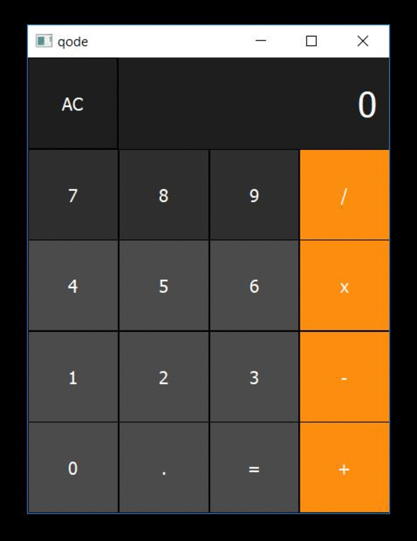
  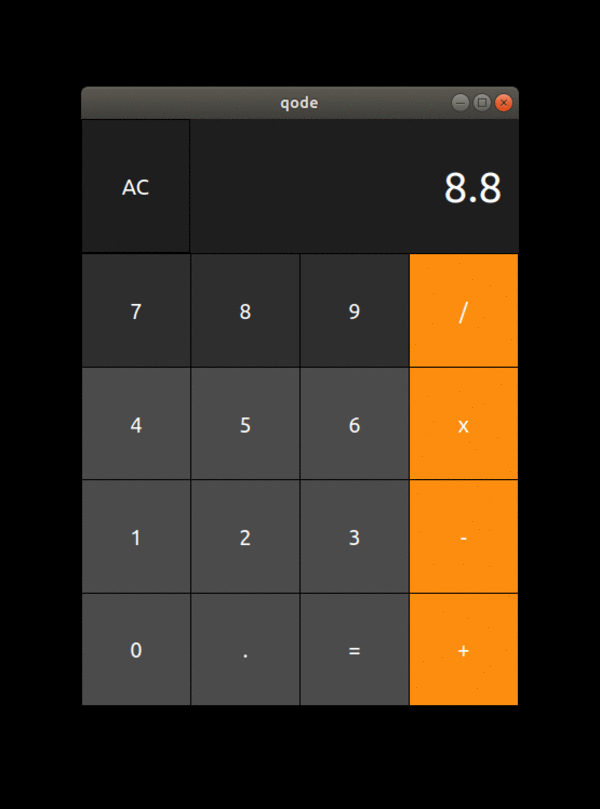
  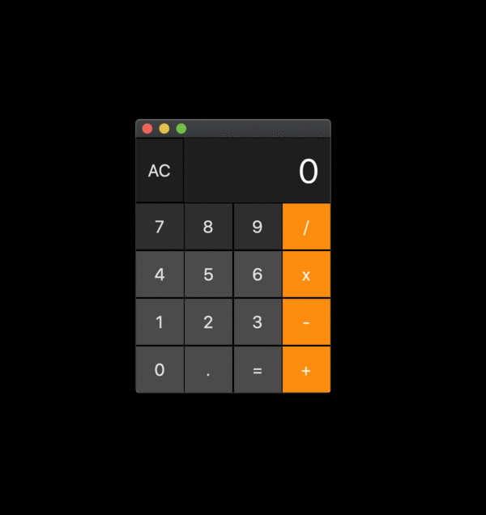
</div>
<div><center><i><b>Calculator clone: win, linux & mac</b></i></center></div>

### Try it out! 🧙‍♂️

```
git clone https://github.com/nodegui/nodegui-starter
cd nodegui-starter
npm install
npm run build
npm start
```

A simple hello world project looks like:

```js
const {
  QMainWindow,
  QWidget,
  QLabel,
  FlexLayout
} = require("@nodegui/nodegui");

const win = new QMainWindow();

const centralWidget = new QWidget();
centralWidget.setObjectName("myroot");
const rootLayout = new FlexLayout();
centralWidget.setLayout(rootLayout);

const label = new QLabel();
label.setObjectName("mylabel");
label.setText("Hello");

const label2 = new QLabel();
label2.setText("World");
label2.setInlineStyle(`
  color: red;
`);

rootLayout.addWidget(label);
rootLayout.addWidget(label2);
win.setCentralWidget(centralWidget);
win.setStyleSheet(
  `
    #myroot {
      background-color: #009688;
      height: '100%';
      align-items: 'center';
      justify-content: 'center';
    }
    #mylabel {
      font-size: 16px;
      font-weight: bold;
    }
  `
);
win.show();

(global as any).win = win;  //to prevent gc
```

# React NodeGui

<div style="display:flex; flex-direction:row; justify-content: center;align-items:center;">
  
+
  
</div>

React NodeGui: [@nodegui/react-nodegui](https://www.npmjs.com/package/@nodegui/react-nodegui) is a ⚛️ react renderer for NodeGui. This means you can create your views using React components similar to that of React Native. React NodeGui is powered by React ⚛️ and Qt5 💚 which makes it easy to build performant, native and cross-platform desktop applications. With react nodegui you have complete access to all React APIs including hooks. React NodeGui makes it much more easy to manage all the views via Javascript.

### Try it out! 🧙‍♂️

The same example we saw above in NodeGui would look like this in react-nodegui

```
git clone https://github.com/nodegui/react-nodegui-starter
cd react-nodegui-starter
npm install
npm run build
npm start
```

A simple hello world project looks like:

```js
import { Renderer, View, Text, Window } from '@nodegui/react-nodegui'
import React from 'react'

const App = () => {
  return (
    <Window styleSheet={styleSheet}>
      <View id="myroot">
        <Text id="mylabel">{`Hello`}</Text>
        <Text style={'color: red;'}>{`World`}</Text>
      </View>
    </Window>
  )
}

const styleSheet = `
  #myroot {
    background-color: #009688;
    height: '100%';
    align-items: 'center';
    justify-content: 'center';
  }
  #mylabel {
    font-size: 16px;
    font-weight: bold;
  }
`

Renderer.render(<App />)
```

The output looks like this:

<div style="display:flex;flex-direction:row;justify-content:space-around;">
  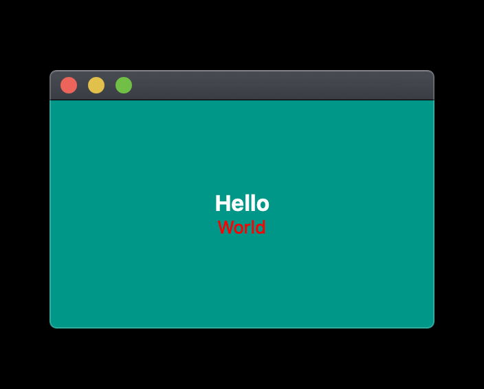
</div>

<br/>

> Disclaimer: Please keep in mind that both NodeGui and React NodeGui are at their infancy stage. Hence, I would hold on for some more time before using it in production. This post is primarily aimed at encouraging contributions to the project.

# Some more example screenshots

The source code for all these examples are here: https://github.com/nodegui/react-nodegui/tree/master/examples/

<div style="display:flex;flex-direction:row;justify-content:space-around;flex-wrap: wrap;">
  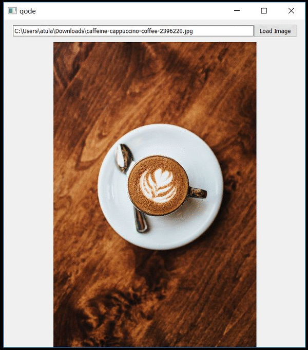
  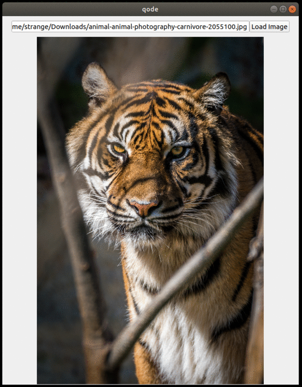
  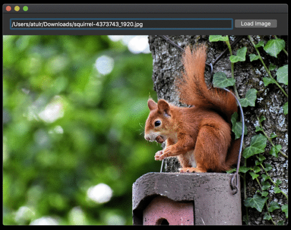
</div>
<div><center><i><b>Image Viewer: win, linux and mac</b></i></center></div>
<br/>
<br/>
<div style="display:flex;flex-direction:row;justify-content:space-around;flex-wrap: wrap;">
  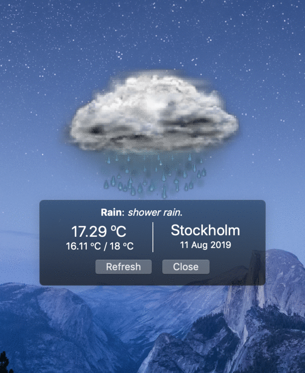
  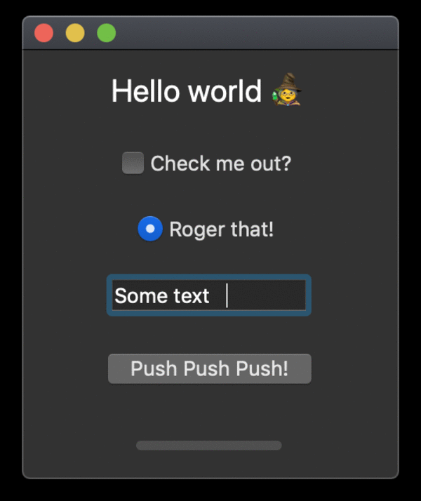
</div>
<div><center><i><b>More examples: A weather widget  & kitchen app</b></i></center></div>

# Development and Support

NodeGui and React NodeGui are open source projects. If you like where these projects are heading please do <a href="https://github.com/nodegui/nodegui">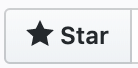</a> the respective repos.

The code is structured for simplicity such that anyone who is willing to contribute can get started quickly. There is also a decent contributor's guide which also contains links to blog posts that can get you started even if you have no clue about nodejs addons, etc. I would suggest you to give it a shot. If anything is unclear you can raise an issue on the respective project repos on Github and we would be more than happy to help. We aim to make the project easy to develop and use. Hence, pull requests are always welcome.

If you can support the project financially 💰 please hit the <a href="https://github.com/nodegui/nodegui">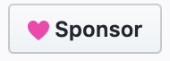</a> button on the Github repo.

I hope we can build an awesome library together ❤ Cheers 🍺
