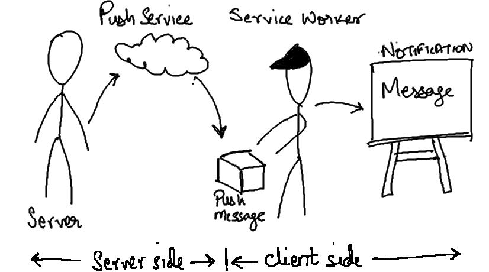
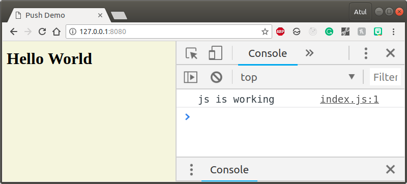
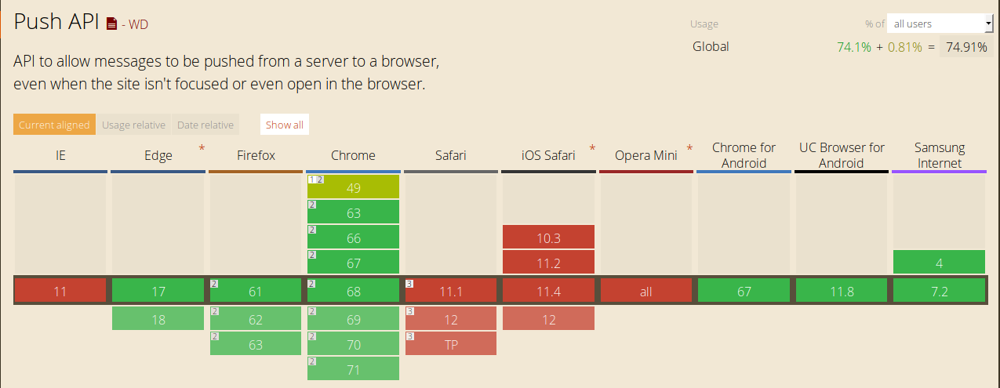
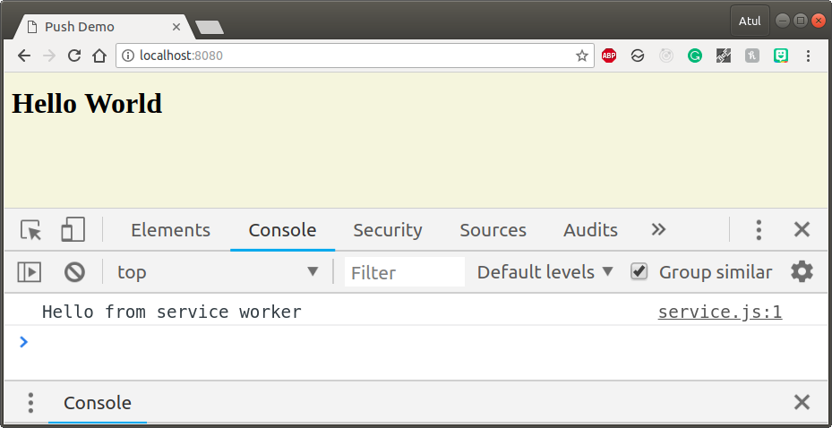
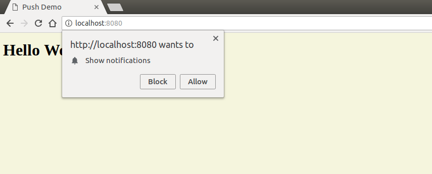
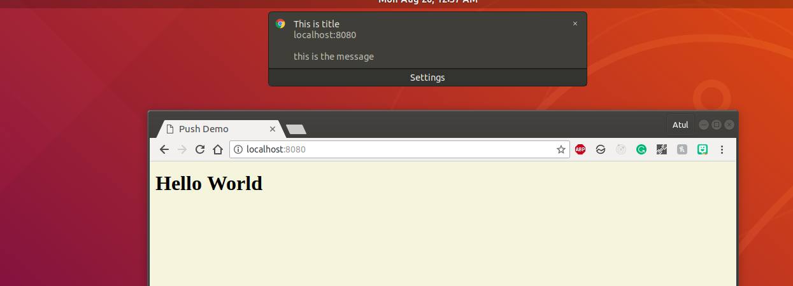

Push notifications are very common in the native mobile application platforms like Android & iOS.
The are most effective ways to re-engage users to your apps. This post deals with  

A push notification can be of two types:<br/>
1. Local Notification: This is generated by your app itself. 
2. Remote Notification: This is generated by a server.


## Overview

Components needed for Push Notification:
1. <a href="https://developers.google.com/web/fundamentals/primers/service-workers/" target="_blank">Service Workers</a>
2. Notification API: This API is used to show a notification prompt to the user just like in case of mobile devices.
3. Push API: This API is used to get the push message from the server.




The steps involved in making a local push notification: <br/>
1. Ask for permission from the user using the Notification APIs **requestPermission** method.
2. If permission granted : 
    - Brilliant! Now we use our service worker to subscribe to a Push Service using Push API.
    - Our Service Worker now listens for push events. 
    - On arrival of a push event, service worker awakens and uses the information from the push message to show a notification using notification API.
3. If permission denied : There is nothing much you can do here. So make sure you handle this case in code as well.

## Step 0: Boilerplate

Lets create a basic web app (no frameworks).

```sh

 mkdir push_demo
 cd push_demo
 git init
 touch index.html index.css index.js

```
Now we have a basic project structure.  Lets add some basic code.

**index.html**
```html
<!DOCTYPE html>
<html>
<head>
    <meta charset="utf-8" />
    <meta http-equiv="X-UA-Compatible" content="IE=edge">
    <title>Push Demo</title>
    <meta name="viewport" content="width=device-width, initial-scale=1">
    <link rel="stylesheet" type="text/css" media="screen" href="index.css" />
    <script src="index.js"></script>
</head>
<body>
       <h1>Hello World</h1> 
</body>
</html>
```
**index.js**
```js
console.log('js is working');
```
**index.css**
```css
body {
    background-color: beige
}
```

To run this project locally, lets use a simple development server. I will be using `http-server` npm module.
```sh
npm install -g http-server
```

Inside the push_demo directory run
```sh
http-server
```
Now open up `http://127.0.0.1:8080/` on browser, you should get:



## Support
To make push notifications work we need Browser <a href="https://developer.mozilla.org/en-US/docs/Web/API/Push_API" target="_blank">Push API</a> and <a href="https://developers.google.com/web/fundamentals/primers/service-workers/" target="_blank">Service Workers</a>. 
Almost all browsers support Service Workers. Browser support for Push API is also [good](https://caniuse.com/#search=push%20api).
Except Safari *(Has custom implementation of Push API)*, all major browsers support it.


Lets check support in our code. Change the contents of **index.js** to:<br/>
**index.js**
```js

const check = () => {
    if (!('serviceWorker' in navigator)) {
        throw new Error('No Service Worker support!');
    }
    if (!('PushManager' in window)) {
        throw new Error('No Push API Support!');
    }
}

const main = () => {
    check();
}

main();

```
If the output in the browser console doesn't show any errors at this point, you are good to go.

## Step 1: Register a Service Worker and Get Permission for Notification

To register a service worker that runs in background:<br/>
First we add a new js file **service.js** : This will contain all our service worker code that will run on a separate thread.

**service.js**
```js
console.log("Hello from service worker");
```
Now modify the **index.js** to:
```js
const check = () => {
    ....
    ....
}

// I added a function that can be used to register a service worker.
const registerServiceWorker = async () => {
    const swRegistration = await navigator.serviceWorker.register('service.js'); //notice the file name
    return swRegistration;
}


const main = async () => { //notice I changed main to async function so that I can use await for registerServiceWorker
    check();
    const swRegistration = await registerServiceWorker();
}

main();
```
Lets run and see:


Since service workers are registered only once, If you refresh the app using browser refresh button you will not see `Hello from service worker` again.
As service workers are event oriented, if we need to do something useful with service workers we will need to listen to events inside it.

**Debugging Tip for Service workers** <br/>
If you are using Chrome dev tools: You can go to **Application Tab > Service Workers**. Here you can unregister the service worker and refresh the app again. <br/>
For debugging purposes, I would suggest you enable **update on reload** checkbox on the top to avoid manual unregister every time you change the service worker file. More detailed guide <a href="https://developers.google.com/web/fundamentals/codelabs/debugging-service-workers/" target="_blank">here</a>.


**Permission for Notification**

In order to show a web notification to the user, the web app needs to get permission from the user. <br/>
Modify the **index.js** to: 
```js
....
....

const registerServiceWorker = async () => {
   ....
   ....
}

const requestNotificationPermission = async () => {
    const permission = await window.Notification.requestPermission();
    // value of permission can be 'granted', 'default', 'denied'
    // granted: user has accepted the request
    // default: user has dismissed the notification permission popup by clicking on x
    // denied: user has denied the request.
    if(permission !== 'granted'){
        throw new Error('Permission not granted for Notification');
    }
}

const main = async () => {
    check();
    const swRegistration = await registerServiceWorker();
    const permission =  await requestNotificationPermission();
}

main();

```

Lets refresh and see what happens.



You can also get the value of permission via
```js
console.log(Notification.permission);
// This will output: granted, default or denied
```

**Note:**
*We are asking for notification permission in the main function since this is a demo app. But ideally, we should not be doing it here as it accounts for bad UX. <a href="https://developers.google.com/web/fundamentals/push-notifications/permission-ux" target="_blank">More details on where you should be calling it in a production app here</a>.*

*An alternative approach here would be to add a button asking the user to subscribe to notifications and then on click of that button we show the notification prompt.*

## Step 2: Local Notification

Now that we have the permission from the user. We can go ahead and try out the notification popup.<br/>
To do that modify **index.js**
```js
....
....

const requestNotificationPermission = async () => {
   ....
   ....
}

const showLocalNotification = (title, body, swRegistration) => {
    const options = {
        body,
        // here you can add more properties like icon, image, vibrate, etc.
    };
    swRegistration.showNotification(title, options);
 
}

const main = async () => {
    check();
    const swRegistration = await registerServiceWorker();
    const permission =  await requestNotificationPermission();
    showLocalNotification('This is title', 'this is the message', swRegistration);
}

main();

```

Possible values of Notification Option:
```json
const options = {
  "//": "Visual Options",
  "body": "<String>",
  "icon": "<URL String>",
  "image": "<URL String>",
  "badge": "<URL String>",
  "vibrate": "<Array of Integers>",
  "sound": "<URL String>",
  "dir": "<String of 'auto' | 'ltr' | 'rtl'>",

  "//": "Behavioural Options",
  "tag": "<String>",
  "data": "<Anything>",
  "requireInteraction": "<boolean>",
  "renotify": "<Boolean>",
  "silent": "<Boolean>",

  "//": "Both Visual & Behavioural Options",
  "actions": "<Array of Strings>",

  "//": "Information Option. No visual affect.",
  "timestamp": "<Long>"
}

```
<br/>
<a href="https://developer.mozilla.org/en-US/docs/Web/API/notification" target="_blank">Details of each and every property is listed here</a>

Notice here that I am displaying the notification from the main thread (index.js). Ideally we will not do this in the main thread since notifications are only useful for re engaging the user back to your app. If you show notification when the user is on your page, then the user actually gets distracted. 
Hence, In practical usecase we will call **showNotification** from the **service.js** file.  We will do that when we implement remote notifications. Here I just wanted to show you how the **showNotification** call looks like.



## Step 3: Remote Notification

### Listen to Remote Notification


### Generate Remote Notification

## Step 4: Handle Permission denied


## References

- https://developers.google.com/web/fundamentals/codelabs/push-notifications/
- https://developer.mozilla.org/en-US/docs/Web/API/Push_API
- https://developers.google.com/web/fundamentals/primers/service-workers/
- https://blog.sessionstack.com/how-javascript-works-the-mechanics-of-web-push-notifications-290176c5c55d
- https://developers.google.com/web/fundamentals/primers/service-workers/
- https://developers.google.com/web/fundamentals/codelabs/debugging-service-workers/
- https://developers.google.com/web/fundamentals/push-notifications/permission-ux