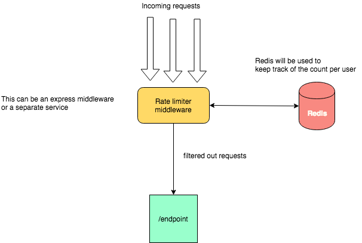

Recently I came across an interesting problem of building an API rate limiter. While doing a bit of research on the same, I came across various algorithms and approaches. Some of the popular algorithms used to implement rate limiting are:

- Token bucket
- Leaky bucket
- Fixed window counter
- Sliding window log
- Sliding window counter

**This post is NOT about these algorithms**. I will try and explain an _alternative_ approach here which makes use of certain Redis specific features. I would love to know any constructive criticism/feedback 🔥 on it. Please let me know in the comment section below 😬.

# Design/Algorithm

High level system setup looks like this:


Lets say we have some way of uniquely identifying the source of each request. This can be the ip address, API key, user token or even user name.

For this example lets assume this unique identifier is a user token and we want to set a rate limit of 20 requests per min for the user. Now for each user we maintain one key in our redis store.

Basic idea is whenever we receive a request:

- We extract the **unique id (user_token)** that helps us identify the user. Lets say **user_token="abcdefghijklmno"**
- Start a **transaction** to our redis store.
- **Set a redis key (abcdefghijklmno)** with value 0 if it doesnt exist already and **expiry as 60sec**

  ```js
  SET abcdefghijklmno 0 EX 60 NX
  ```

  This will allow us to set the key to 0 if it doesnt exist and auto expire/clean the key after 60 secs. Not this doesnt alter the key if it already exists.

- **Increment the value** of the key (abcdefghijklmno)
  ```js
  INCR abcdefghijklmno
  ```
  Here we will keep on incrementing the value of abcdefghijklmno as and when requests come.
- **Execute the transaction**.
  By doing these two operations in a transaction we do this atomically and hence are safe from race conditions.
- In the result of the transaction we will get the current value of `abcdefghijklmno` which is the total requests made by the user within 60sec. If this value is greater than the threshold (in our case 20) we reject the request.

### TLDR;

Redis commands:

```js
> MULTI
OK
> SET <user_token> 0 EX 60 NX
QUEUED
> INCR <user_token>
QUEUED
> EXEC
1) OK
2) (integer) 1
```

If the value of integer in the last request is greater than 20 we reject the request.

# Show me some code 💻

Lets take the case of a simple express server. A typical express server will have some code like this:

```js
...
...
const app = express()
app.post('/login', loginHandler)
app.get('/ping', pingHandler)
app.get('/api-1', api1Handler)
app.post('/api-2', api2Handler)
app.get('/api-3', api3Handler)
...
...
...
```

Here we have few api endpoints defined. Now lets say we need to rate limit the endpoints **/api-1**, **/api-2** and **/api-3** to 20 request per min.

To do this we can create an express middleware as follows:
**rateLimiter.js**

```js
const rateLimiter => (req, res, next) => {
  return next()
}

module.exports = { rateLimiter }
```

and add it before the endpoints to be rate limited.

```js
...
...
const { rateLimiter } = require('./rateLimiter')
...
...
const app = express()
app.post('/login', loginHandler)
app.get('/ping', pingHandler)
app.use(rateLimiter) // middleware to limit requests to api-1,api-2, api-3
app.get('/api-1', api1Handler)
app.post('/api-2', api2Handler)
app.get('/api-3', api3Handler)
...
...
...
```

At the moment our rateLimiter middleware just passes all the request to the subsequent handlers.
Modify **rateLimiter.js**

```js
const redis = require('redis')

const client = redis.createClient(process.env.REDIS_URL)

client.on('error', err => console.log(`Error ${err}`))

const rateLimiter  => (req, res, next) => {
  const token = req.user.token // get the unique identifier for the user here
  // I am using token here but it can be ip address, API_KEY, etc
  client
    .multi() // starting a transaction
    .set([token, 0, 'EX', 60, 'NX']) // SET UUID 0 EX 60 NX
    .incr(token) // INCR UUID
    .exec((err, replies) => {
      if (err) {
        return res.status(500).send(err.message)
      }
      const reqCount = replies[1]
      if (reqCount > 20) {
        return res
          .status(403)
          .send(`Quota of ${20} per ${60}sec exceeded`)
      }
      return next()
    })
}

module.exports = { rateLimiter }
```

Now our middleware rate limits each user to 20 requests per minute.

In ~20 lines of code we have our very own simple and performant rate limiter. 😎🤘🏽

I hope you enjoyed reading this post. Do let me know your constructive feedback on the comments below.

# References

- https://medium.com/@saisandeepmopuri/system-design-rate-limiter-and-data-modelling-9304b0d18250
- https://en.wikipedia.org/wiki/Rate_limiting
- https://redis.io/commands
