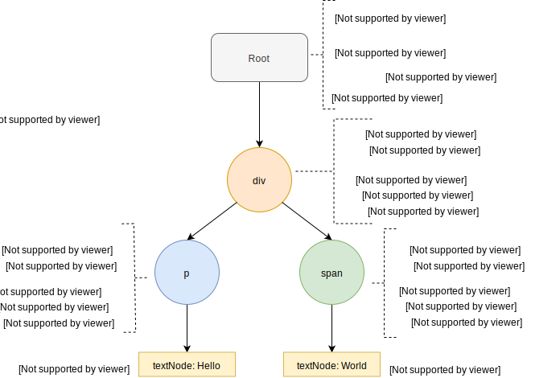

---

This is the continuation of the post here: <a href='/react-custom-renderer-1/' target='_blank'>⚛️👆 Part 1/3 - Beginners guide to React Renderers. How to build your own renderer from scratch?</a>. I would strongly recommend reading Part 1 before. This part will cover **the initial render phase of the renderer**.

- The update phase would be covered in <a href='/react-custom-renderer-3/' target='_blank'>⚛️🤟 Part 3/3 - Beginners guide to React Renderers. How to build your own renderer from scratch?</a>.

---

## HostConfig

**Recap**: Renderers are required to implement all the necessary platform specfic functions inside the **HostConfig**.
Our HostConfig looks like this at the moment.

```js
const HostConfig = {
  //TODO We will specify all required methods here
}
```

<br/>

From the <a href='https://github.com/facebook/react/blob/dac9202a9c5add480f853bcad2ee04d371e72c0c/packages/react-reconciler/src/forks/ReactFiberHostConfig.custom.js' target='_blank'>source code of **react-reconciler**</a>, we find the complete list of methods in hostConfig
as follows:

```js
HostConfig.getPublicInstance
HostConfig.getRootHostContext
HostConfig.getChildHostContext
HostConfig.prepareForCommit
HostConfig.resetAfterCommit
HostConfig.createInstance
HostConfig.appendInitialChild
HostConfig.finalizeInitialChildren
HostConfig.prepareUpdate
HostConfig.shouldSetTextContent
HostConfig.shouldDeprioritizeSubtree
HostConfig.createTextInstance
HostConfig.scheduleDeferredCallback
HostConfig.cancelDeferredCallback
HostConfig.setTimeout
HostConfig.clearTimeout
HostConfig.noTimeout
HostConfig.now
HostConfig.isPrimaryRenderer
HostConfig.supportsMutation
HostConfig.supportsPersistence
HostConfig.supportsHydration
// -------------------
//      Mutation
//     (optional)
// -------------------
HostConfig.appendChild
HostConfig.appendChildToContainer
HostConfig.commitTextUpdate
HostConfig.commitMount
HostConfig.commitUpdate
HostConfig.insertBefore
HostConfig.insertInContainerBefore
HostConfig.removeChild
HostConfig.removeChildFromContainer
HostConfig.resetTextContent
HostConfig.hideInstance
HostConfig.hideTextInstance
HostConfig.unhideInstance
HostConfig.unhideTextInstance
// -------------------
//     Persistence
//     (optional)
// -------------------
HostConfig.cloneInstance
HostConfig.createContainerChildSet
HostConfig.appendChildToContainerChildSet
HostConfig.finalizeContainerChildren
HostConfig.replaceContainerChildren
HostConfig.cloneHiddenInstance
HostConfig.cloneUnhiddenInstance
HostConfig.createHiddenTextInstance
// -------------------
//     Hydration
//     (optional)
// -------------------
HostConfig.canHydrateInstance
HostConfig.canHydrateTextInstance
HostConfig.getNextHydratableSibling
HostConfig.getFirstHydratableChild
HostConfig.hydrateInstance
HostConfig.hydrateTextInstance
HostConfig.didNotMatchHydratedContainerTextInstance
HostConfig.didNotMatchHydratedTextInstance
HostConfig.didNotHydrateContainerInstance
HostConfig.didNotHydrateInstance
HostConfig.didNotFindHydratableContainerInstance
HostConfig.didNotFindHydratableContainerTextInstance
HostConfig.didNotFindHydratableInstance
HostConfig.didNotFindHydratableTextInstance
```

<br/>
🤬Now, that looks like too much work 🤯. Fortunately, we only need to implement <strong>few of those functions</strong> to get the renderer up and running.🕺🏻👻
<div style="display:flex;flex-direction:row;align-items:center;">

</div>

I will try to explain what most of these methods do, but we will primarily focus on the ones we need. **Disclaimer:** Most of the content is a result of my experimentation with React renderers and reading through the publicly available source code and blog posts. Hence, if you find anything that needs correction, please do let me know in the comments.

**Reconciler calls different functions from host config on the initial render phase as compared to whenever an update occurs via setState**. Lets focus on initial render first.

## Initial render

We are trying to render **src/index.js** that looks like this:

```js
const Text = props => {
  return <p className={props.className}>{props.content}</p>
}

const App = () => {
  return (
    <div>
      <Text className="hello-class" content="Hello" />
      <span style="color:blue;">World</span>
    </div>
  )
}
```

So our rendered view tree should look like this:

<div style="display: block; max-width: 300px; margin: 0 auto;"></div>

Now lets look at the error that we got earlier:  <br/>
From the list of functions in the hostConfig lets implement **now()**.

```js
const HostConfig = {
  now: Date.now,
}
```

**now** is used by the reconciler to calculate the current time. Hence we will provide it **Date.now**.

Refresh! and we get : 
Lets stub this function

```js
const HostConfig = {
  now: Date.now,
  getRootHostContext: function(...args) {
    console.log('getRootHostContext', ...args)
  },
}
```

Refresh! and we get: 

Continuing the chain till we have no more errors we get:

```js
const HostConfig = {
  now: Date.now,
  getRootHostContext: function(...args) {
    console.log('getRootHostContext', ...args)
  },
  getChildHostContext: function(...args) {
    console.log('getChildHostContext', ...args)
  },
  shouldSetTextContent: function(...args) {
    console.log('shouldSetTextContent', ...args)
  },
  createTextInstance: function(...args) {
    console.log('createTextInstance', ...args)
  },
  createInstance: function(...args) {
    console.log('createInstance', ...args)
  },
  appendInitialChild: function(...args) {
    console.log('appendInitialChild', ...args)
  },
  finalizeInitialChildren: function(...args) {
    console.log('finalizeInitialChildren', ...args)
  },
  prepareForCommit: function(...args) {
    console.log('prepareForCommit', ...args)
  },
  resetAfterCommit: function(...args) {
    console.log('resetAfterCommit', ...args)
  },
}
```

Now we should get a blank screen, but our logs should help us figure out what the reconciler is trying to do and in what order these functions are getting called.

_(Right Click on the image and select **Open Image in New Tab** to get a better resolution version)._

The order of execution looks like this:

<a target="_blank" href="./inital_render_tree_flow.svg">
  
</a>
<br />

Now we should be able to guess what these methods do. But instead of just making wild guesses, It is a good idea to read through <a href='https://github.com/facebook/react/blob/409e472fcaae2b6c171f4e9a0c4b5ad88ec2bf21/packages/react-dom/src/client/ReactDOMHostConfig.js#L97' target='_blank'>the source code of <strong>react-dom</strong> to </a> better understand what each of these functions are doing.

### ▸ now

---

This function is used by the reconciler in order to calculate current time for prioritising work. In case of **react-dom**, it uses **performace.now** if available or it falls back to **Date.now**
Hence, lets just keep it as **Date.now** for our custom renderer.

### ▸ getRootHostContext

---

The function signature is:

```js
function getRootHostContext(nextRootInstance) {
  let context = {
    // This can contain any data that you want to pass down to immediate child
  }
  return context
}
```

**_Parameters_**

- **nextRootInstance**: nextRootInstance is basically the root dom node you specify while calling render. This is most commonly `<div id="root"></div>`

**_Return Value_** A context object that you wish to pass to immediate child.

**_Purpose_**

This function lets you share some context with the other functions in this HostConfig.

**_For our custom renderer_**

Hence in our case lets just return a blank object as show above.

```js
getRootHostContext: function (nextRootInstance) {
  let rootContext = {}
  return rootContext
}
```

### ▸ getChildHostContext

---

The function signature is:

```js
function getChildHostContext(parentContext, fiberType, rootInstance) {
  let context = {
    // This can contain any data that you want to pass down to immediate child
  }
  return context
}
```

**_Parameters_**

- **parentContext**: Context from parent. Example: This will contain rootContext for the immediate child of roothost.
- **rootInstance**: rootInstance is basically the root dom node you specify while calling render. This is most commonly `<div id="root"></div>`
- **fiberType**: This contains the type of fiber i.e, 'div', 'span', 'p', 'input' etc.

**_Return Value_** A context object that you wish to pass to immediate child.

**_Purpose_**

This function provides a way to access context from the parent and also a way to pass some context to the immediate children of the current node. Context is basically a regular object containing some information.

**_For our custom renderer_**

Hence in our case lets just return a blank object as show above.

```js
getChildHostContext: function (parentContext, fiberType, rootInstance) {
  let context = {}
  return context
}
```

### ▸ shouldSetTextContent

---

The function signature is:

```js
function shouldSetTextContent(type, nextProps) {
  return Boolean
}
```

**_Parameters_**

- **nextProps**: Contains the props passed to the host react element.
- **type**: This contains the type of fiber i.e, 'div', 'span', 'p', 'input' etc.

**_Return Value_** This should be a boolean value.

**_Purpose_**

If the function returns true, the text would be created inside the host element and no new text element would be created separately.

If this returned true, the next call would be to **createInstance** for the current element and traversal would stop at this node (children of this element wont be traversed).

If it returns false, **getChildHostContext** and **shouldSetTextContent** will be called on the child elements and it will continue till shouldSetTextContent returns true or if the recursion reaches the last tree endpoint which usually is a text node. When it reaches the last leaf text node it will call **createTextInstance**

In case of react-dom the implementation is as follows:

```js
return type === 'textarea' ||
type === 'option' ||
type === 'noscript' ||
typeof props.children === 'string' ||
typeof props.children === 'number' ||
(typeof props.dangerouslySetInnerHTML === 'object' &&
props.dangerouslySetInnerHTML !== null &&
props.dangerouslySetInnerHTML.\_\_html != null)
```

So for these elements react-dom renderer doesn't create a separate text instance in the renderer.

**_For our custom renderer_**

For our case, lets set it to false, so that we get an instance even for text.

```js
shouldSetTextContent: function(type, nextProps) {
  return false
}
```

### ▸ createTextInstance

---

The function signature is:

```js
function createTextInstance(
  newText,
  rootContainerInstance,
  currentHostContext,
  workInProgress
) {
  return textNode
}
```

**_Parameters_**

- **newText**: contains the text string that needs to be rendered.
- **rootContainerInstance**: root dom node you specify while calling render. This is most commonly `<div id="root"></div>`
- **currentHostContext**: contains the context from the host node enclosing this text node. For example, in the case of `<p>Hello</p>`: currentHostContext for **Hello** text node will be host context of `p`.
- **workInProgress**: The fiber node for the text instance. This manages work for this instance.

**_Return Value_** This should be an actual text view element. In case of dom it would be a textNode.

**_Purpose_**

Here we specify how should renderer handle the text content

**_For our custom renderer_**

Lets just create a simple text node and return it.

```js
createTextInstance: function(
  newText,
  rootContainerInstance,
  currentHostContext,
  workInProgress
) {
  return document.createTextNode(newText)
}
```

---

The reconciler is currently at the leaf text node in our traversal. Once it finishes text creation operation, it will move back up and call **createInstance** on the enclosing element.

### ▸ createInstance

---

The function signature is:

```js
function createInstance(
  type,
  newProps,
  rootContainerInstance,
  currentHostContext,
  workInProgress
) {
  return domElement
}
```

**_Parameters_**

- **type**: This contains the type of fiber i.e, 'div', 'span', 'p', 'input' etc.
- **nextProps**: Contains the props passed to the host react element.
- **rootContainerInstance**: root dom node you specify while calling render. This is most commonly `<div id="root"></div>`
- **currentHostContext**: contains the context from the parent node enclosing this node. This is the return value from **getChildHostContext** of the parent node.
- **workInProgress**: The fiber node for the text instance. This manages work for this instance.

**_Return Value_** This should be an actual dom element for the node.

**_Purpose_**

Create instance is called on all **host** nodes except the leaf text nodes. So we should return the correct view element for each host type here. We are also supposed to take care of the props sent to the host element. For example: setting up onClickListeners or setting up styling etc.

**_For our custom renderer_**

Lets just create the appropriate dom element and add all the attributes from the react element.

```js
createInstance: function(
  type,
  newProps,
  rootContainerInstance,
  currentHostContext,
  workInProgress
) {
  const element = document.createElement(type)
  element.className = newProps.className || ''
  element.style = newProps.style
  // ....
  // ....
  // if (newProps.onClick) {
  //   element.addEventListener('click', newProps.onClick)
  // }
  return element
}
```

---

At this point it is important to understand that we are coming back up from recursion. So all child nodes have been instantiated and created. Hence, right after creating instance, we will need to attach the children to this node and that will be done in **appendInitialChild**.

### ▸ appendInitialChild

---

The function signature is:

```js
function appendInitialChild(parent, child) {}
```

**_Parameters_**

- **parent**: The current node in the traversal
- **child**: The child dom node of the current node.

**_Purpose_**

Here we will attach the child dom node to the parent on the initial render phase. This method will be called for each child of the current node.

**_For our custom renderer_**

We will go ahead and attach the child nodes to the parent dom node.

```js
appendInitialChild: (parent, child) => {
  parent.appendChild(child)
}
```

### ▸ finalizeInitialChildren

---

The function signature is:

```js
function finalizeInitialChildren(
  instance,
  type,
  newProps,
  rootContainerInstance,
  currentHostContext
) {
  return Boolean
}
```

**_Parameters_**

- **instance**: The instance is the dom element after appendInitialChild.
- **type**: This contains the type of fiber i.e, 'div', 'span', 'p', 'input' etc.
- **newProps**: Contains the props passed to the host react element.
- **rootContainerInstance**: root dom node you specify while calling render. This is most commonly `<div id="root"></div>`
- **currentHostContext**: contains the context from the parent node enclosing this node. This is the return value from **getChildHostContext** of the parent node.

**_Return Value_** A boolean value which decides if **commitMount** for this element needs to be called.

**_Purpose_**

In case of react native renderer, this function does nothing but return false.

In case of react-dom, this adds default dom properties such as event listeners, etc. For implementing auto focus for certain input elements (autofocus can happen only after render is done), react-dom sends return type as true. This results in **commitMount** method for this element to be called. The commitMount will be called only if an element returns true in finalizeInitialChildren and after the all elements of the tree has been rendered (even after resetAfterCommit).

**_For our custom renderer_**

We can return false in our case. But for experimental purpose, lets return true if autofocus is set to true. Make sure you implement a stub method for **commitMount** in hostConfig if you return true.

```js
finalizeInitialChildren: (
  instance,
  type,
  newProps,
  rootContainerInstance,
  currentHostContext
) => {
  return newProps.autofocus //simply return true for experimenting
}
```

---

Now once all the child instances are done and finalised. Reconciler will move up the recursion to the parent of this node. Remember that the parent of the current node hasn't been instantiated yet. So the reconciler will go up and call **createInstance** → **appendInitialChild** → **finalizeInitialChildren** on the parent. This cycle will happen till we reach the top of the recursion tree. When no more elements are left then **prepareForCommit** will be invoked.

### ▸ prepareForCommit

---

The function signature is:

```js
function prepareForCommit(rootContainerInstance) {}
```

**_Parameters_**

- **rootContainerInstance**: root dom node you specify while calling render. This is most commonly `<div id="root"></div>`

**_Purpose_**

This function is called when we have made a in-memory render tree of all the views (Remember we are yet to attach it the the actual root dom node).
Here we can do any preparation that needs to be done on the rootContainer before attaching the in memory render tree.
For example: In the case of react-dom, it keeps track of all the currently focused elements, disabled events temporarily, etc.

**_For our custom renderer_**

Since we are aiming at a simple renderer, this will be a no-op for us.

```js
prepareForCommit = function(rootContainerInstance) {}
```

---

After prepareForCommit, the reconciler will commit the in memory tree to the rootHost following which the browser will trigger repaint.

### ▸ resetAfterCommit

---

The function signature is:

```js
function resetAfterCommit(rootContainerInstance) {}
```

**_Parameters_**

- **rootContainerInstance**: root dom node you specify while calling render. This is most commonly `<div id="root"></div>`

**_Purpose_**

This function gets executed after the inmemory tree has been attached to the root dom element. Here we can do any post attach operations that needs to be done. For example: react-dom re-enabled events which were temporarily disabled in prepareForCommit and refocuses elements, etc.

**_For our custom renderer_**

Since we are aiming at a simple renderer, this will be a no-op for us.

```js
resetAfterCommit = function(rootContainerInstance) {}
```

<br/>

---

Now after this, we expect our document to be rendererd but it <span style="color:red; font-weight:bold;">DOES NOT</span>.
The issue is we dont have code that tells how to append our in-memory tree to the root div. The answer to this is **appendChildToContainer**

### ▸ appendChildToContainer

---

The function signature is:

```js
function appendChildToContainer(parent, child) {}
```

**_Parameters_**

- **parent**: The root div or the container.
- **child**: The child dom node tree or the in-memory tree.

**_Purpose_**

Here we will our in-memory tree to the root host div. But this function only works if we set <span style="color:blue; font-weight:bold;">supportsMutation:true</span>.

**_For our custom renderer_**

We will go ahead and attach the child nodes to the root dom node.

```js
appendChildToContainer: (parent, child) => {
  parent.appendChild(child)
},
supportsMutation: true,
```

## Demo

Now, lets refresh our React App!


---

Holy!!! We just built our very own mini React 😎🎉🎊🤟

<div style="display:flex;flex-direction:row;align-items:center;">

</div>

## Before we finish

lets implement **commitMount** also.

### ▸ commitMount

---

The function signature is:

```js
function commitMount(domElement, type, newProps, fiberNode) {}
```

**_Parameters_**

- **domElement**: The rendered, attached dom element for this react element.
- **type**: This contains the type of fiber i.e, 'div', 'span', 'p', 'input' etc.
- **newProps**: Contains the props passed to the host react element.
- **fiberNode**: The fiber node for the element. This manages work for this instance.

**_Purpose_**

This function is called for every element that has set the return value of **finalizeInitialChildren** to true.
This method is called after all the steps are done (ie after resetAfterCommit), meaning the entire tree has been attached to the dom. This method is mainly used in react-dom for implementing autofocus. This method exists in react-dom only and not in react-native.

According to a comment in react-dom source code.

> Despite the naming that might imply otherwise, this method only
> fires if there is an `Update` effect scheduled during mounting.
> This happens if `finalizeInitialChildren` returns `true` (which it
> does to implement the `autoFocus` attribute on the client). But
> there are also other cases when this might happen (such as patching
> up text content during hydration mismatch).

**_For our custom renderer_**

We will go ahead and call focus on the dom element.

```js
commitMount: (domElement, type, newProps, fiberNode) => {
   domElement.focus();
},
```

<br>

**<a href='https://github.com/master-atul/blog-custom-renderer/tree/31d5ff827565ef8f4f8e5061b97c16ec3b6a279f' target='_blank'>Link to source code till here</a>**

<br>

Our HostConfig looks like this now:

```js
const HostConfig = {
  now: Date.now,
  getRootHostContext: function(nextRootInstance) {
    let rootContext = {}
    return rootContext
  },
  getChildHostContext: function(parentContext, fiberType, rootInstance) {
    let context = { type: fiberType }
    return context
  },
  shouldSetTextContent: function(type, nextProps) {
    return false
  },
  createTextInstance: function(
    newText,
    rootContainerInstance,
    currentHostContext,
    workInProgress
  ) {
    return document.createTextNode(newText)
  },
  createInstance: function(
    type,
    newProps,
    rootContainerInstance,
    currentHostContext,
    workInProgress
  ) {
    const element = document.createElement(type)
    element.className = newProps.className || ''
    element.style = newProps.style
    // ....
    // ....
    // if (newProps.onClick) {
    //   element.addEventListener('click', newProps.onClick)
    // }
    return element
  },
  appendInitialChild: (parent, child) => {
    parent.appendChild(child)
  },
  finalizeInitialChildren: (
    instance,
    type,
    newProps,
    rootContainerInstance,
    currentHostContext
  ) => {
    return newProps.autofocus //simply return true for experimenting
  },
  prepareForCommit: function(rootContainerInstance) {},
  resetAfterCommit: function(rootContainerInstance) {},
  commitMount: (domElement, type, newProps, fiberNode) => {
    domElement.focus()
  },
  appendChildToContainer: (parent, child) => {
    parent.appendChild(child)
  },
  supportsMutation: true,
}
```

Cool! We have built a tiny renderer that can render JSX to the dom. Next part of the blog post series will focus solely on the update (which is why we use react in the first place 😉).

<div style="display:flex;flex-direction:row;align-items:center;">
    
</div>

---

---

Next part of the blog series will cover the update phase of the renderer after setState is invoked. <a href='/react-custom-renderer-3/' target='_blank'>⚛️🤟 Part 3/3 - Beginners guide to React Renderers. How to build your own renderer from scratch?</a>.

---

---

# References

- https://github.com/facebook/react/tree/master/packages/react-dom
- https://medium.com/@agent_hunt/react-is-also-the-llvm-for-creating-declarative-ui-frameworks-767e75ce1d6a
- https://medium.com/@agent_hunt/hello-world-custom-react-renderer-9a95b7cd04bc
- https://github.com/nitin42/Making-a-custom-React-renderer
- https://goshakkk.name/react-custom-renderers/
- https://hackernoon.com/learn-you-some-custom-react-renderers-aed7164a4199
