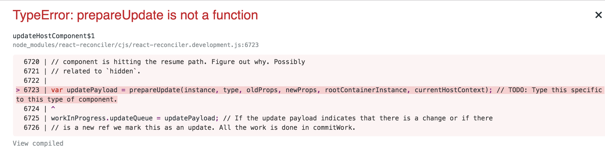
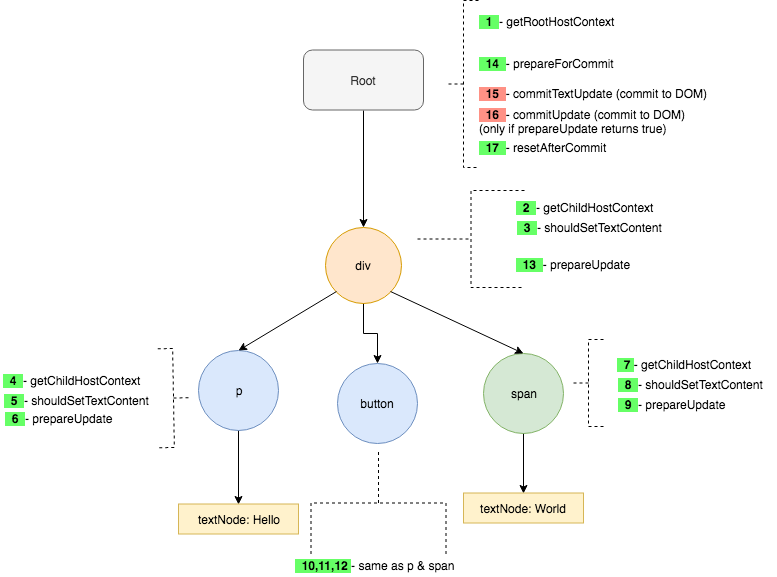

This is the third post of 3 post series on Custom React Renderers.This post will cover **the update phase of the renderer**.

I strongly recommend you to read earlier posts before reading this post.

- <a href='/react-custom-renderer-1/' target='_blank'>⚛️👆 Part 1/3 - Beginners guide to Custom React Renderers...</a> and
- <a href='/react-custom-renderer-2/' target='_blank'>⚛️✌️ Part 2/3 - Beginners guide to Custom React Renderers...</a>.

---

At this point we have a custom react renderer that can render our react app into the DOM tree.

Our HostConfig looks like this now:

```js
const HostConfig = {
  now: Date.now,
  getRootHostContext: function (nextRootInstance) {
    let rootContext = {}
    return rootContext
  },
  getChildHostContext: function (parentContext, fiberType, rootInstance) {
    let context = { type: fiberType }
    return context
  },
  shouldSetTextContent: function (type, nextProps) {
    return false
  },
  createTextInstance: function (
    newText,
    rootContainerInstance,
    currentHostContext,
    workInProgress
  ) {
    return document.createTextNode(newText)
  },
  createInstance: function (
    type,
    newProps,
    rootContainerInstance,
    currentHostContext,
    workInProgress
  ) {
    const element = document.createElement(type)
    element.className = newProps.className || ''
    element.style = newProps.style
    // ....
    // ....
    // if (newProps.onClick) {
    //   element.addEventListener('click', newProps.onClick)
    // }
    return element
  },
  appendInitialChild: (parent, child) => {
    parent.appendChild(child)
  },
  finalizeInitialChildren: (
    instance,
    type,
    newProps,
    rootContainerInstance,
    currentHostContext
  ) => {
    return newProps.autofocus //simply return true for experimenting
  },
  prepareForCommit: function (rootContainerInstance) {},
  resetAfterCommit: function (rootContainerInstance) {},
  commitMount: (domElement, type, newProps, fiberNode) => {
    domElement.focus()
  },
  appendChildToContainer: (parent, child) => {
    parent.appendChild(child)
  },
  supportsMutation: true,
}
```

and this is our App code.

```js
import React from 'react'
// import ReactDOM from "react-dom";
import CustomRenderer from './renderer'

const Text = (props) => {
  return <p className={props.className}>{props.content}</p>
}

const App = () => {
  return (
    <div>
      <Text className="hello-class" content="Hello" />
      <span style="color:blue;" autofocus>
        World
      </span>
    </div>
  )
}

// ReactDOM.render(<App />, document.getElementById("root"));
CustomRenderer.render(<App />, document.getElementById('root'))
```

Now lets add state to our app and use a button to change the state on click and see what happens.

```js
import React from 'react'
// import ReactDOM from "react-dom";
import CustomRenderer from './renderer'

const Text = (props) => {
  return <p className={props.className}>{props.content}</p>
}

class App extends React.Component {
  state = {
    text: Date.now(),
  }
  onButtonClick = () => {
    this.setState(() => ({ text: Date.now() }))
  }
  render() {
    return (
      <div>
        <Text className="hello-class" content={this.state.text} />
        <span style="color:blue;" autofocus>
          World
        </span>
        <button onClick={this.onButtonClick}>Get current time</button>
      </div>
    )
  }
}

// ReactDOM.render(<App />, document.getElementById("root"));
CustomRenderer.render(<App />, document.getElementById('root'))
```

Now, you should see a button like this:


When you try and click on the button, we see that nothing happens. This is happening because our onClick listener is not getting invoked. And the reason why this happens is because our renderer doesnt know what to do with **onClick** prop on the button.
Lets add that functionality to our **hostConfig**

```js
...
...
...
createInstance: function(
    type,
    newProps,
    rootContainerInstance,
    currentHostContext,
    workInProgress
  ) {
    const element = document.createElement(type);
    element.className = newProps.className || "";
    element.style = newProps.style;
    // ....
    // ....
    if (newProps.onClick) {
      element.addEventListener("click", newProps.onClick);
    }
    return element;
  },
...
...
...
```

Refresh and click on the button. Boom! we get an error.



Well 🤷🏻‍ atleast it means that our **onClick** listener is now working. Lets stub this method in our hostConfig.

```js
...
  prepareUpdate: function(...args) {
    console.log("prepareUpdate", ...args);
  }
...
```

We get another error related to **commitTextUpdate** now. Lets stub that too.

```js
...
 commitTextUpdate: function(...args) {
    console.log("commitTextUpdate", ...args);
  }
...
```

No more errors! Now, lets take a look at their respective implementations.

### ▸ prepareUpdate

---

The function signature is:

```js
function prepareUpdate(
  instance,
  type,
  oldProps,
  newProps,
  rootContainerInstance,
  currentHostContext
) {
  return {
    /* update payload */
  }
}
```

**_Parameters_**

- **instance**: instance is the current dom instance of the node.
- **type**: This contains the type of fiber i.e, 'div', 'span', 'p', 'input' etc.
- **oldProps**: props before this update.
- **newProps**: new props.
- **rootContainerInstance**: root dom node you specify while calling render. This is most commonly `<div id="root"></div>`
- **currentHostContext**: contains the context from the parent node enclosing this node. This is the return value from **getChildHostContext** of the parent node.

**_Return Value_** This function should return a payload object. Payload is a Javascript object that can contain information on what needs to be changed on this host element. If returned true,

**_Purpose_**
Prepare update is called first on the node, where the prop change occurs and then it is called on all the tree nodes recursively.
This method can be used to hint the reconciler whether an update needs to be performed on this node or not. If this function doesnt return anything, then reconciler decides whether the update should be performed on this node or not based on its algorithm.

The idea is that we will NOT perform any dom changes in this function. Dom changes should be done on the commit phase of the renderer only. Once the tree traversal for the prepareUpdate is done, then prepareForCommit method will be called on rootContainer followed by **commitUpdate** on each node where we returned an updatePayload from **prepareUpdate**.

**_For our custom renderer_**

We will do nothing here.

```js
prepareUpdate : function (
  instance,
  type,
  oldProps,
  newProps,
  rootContainerInstance,
  currentHostContext
) {
  return; //return nothing.
}
```

---

### ▸ commitUpdate

---

The function signature is:

```js
function commitUpdate(
  instance,
  updatePayload,
  type,
  oldProps,
  newProps,
  finishedWork
) {
  return {
    /* update payload */
  }
}
```

**_Parameters_**

- **instance**: instance is the current dom instance of the node.
- **updatePayload**: update payload from **prepareUpdate** on the same node.
- **type**: This contains the type of fiber i.e, 'div', 'span', 'p', 'input' etc.
- **oldProps**: props before this update.
- **newProps**: new props.
- **finishedWork**: The fiber node that manages work for this instance.

**_Purpose_**
Here we perform all updates that we queued using prepareUpdate method. We will get the instance, the updatePayload, old and new props etc. This is where we should do all our dom manupulation work if needed.

**_For our custom renderer_**

We will do nothing here.

```js
commitUpdate: function(
    instance,
    updatePayload,
    type,
    oldProps,
    newProps,
    finishedWork
  ) {
    return; //return nothing.
  },
```

---

### ▸ commitTextUpdate

---

The function signature is:

```js
function commitTextUpdate(textInstance, oldText, newText) {
  /** perform dom update on textInstance **/
}
```

**_Parameters_**

- **textInstance**: instance is the current text node on the dom.
- **oldText**: text before this update.
- **newText**: new text to be updated.

**_Purpose_**
Here we perform the actual dom update on the textNode.

**_For our custom renderer_**

Lets update the text node.

```js
commitTextUpdate: function(textInstance, oldText, newText) {
    textInstance.nodeValue = newText;
}
```

---

Now, lets run our app and see what happens. Click that "Get current time" button 👊🏽. Our text field should now update to the latest value in the state. 🥳🥳🥳

### Order of Execution for Update

If you see the list of all functions in the hostConfig from React Dom source code, you should see a lot of functions that are not yet covered but seem like somewhat related to update functionality. After playing around a lot with the renderer this is the order of execution that I came up with.


_(Right Click on the image and select **Open Image in New Tab** to get a better resolution version)._

This covers all the basic methods of the renderer during first time render and subsequent updates.

### Methods used for edge cases (during Commit Phase)

Now if you take a look a the hostConfig, you will find that there are still few methods that are not covered yet. If you play around with renderer a bit more you will find thats some of those methods will be triggered during certain edge cases.

---

### ▸ appendChild

---

The function signature is:

```js
function appendChild(parentInstance, child) {}
```

**_Parameters_**

- **parentInstance**: the parent dom node into which a new child node needs to be appended at the end.
- **child**: the new dom node that needs to be inserted.

**_Purpose_**
This function is called whenever a new element needs to be inserted into a parent element at the end. For example:

```html
<div>
  <p>test</p>
  {this.state.test === "yolo" && <button>Hello</button>}
</div>
```

So here when state.test becomes yolo. This function will be called with parentInstance = div and child = button in the commit Phase.

**_For our custom renderer_**

```js
appendChild: function(parentInstance, child) {
    parentInstance.appendChild(child);
}
```

---

### ▸ insertBefore

---

The function signature is:

```js
function insertBefore(parentInstance, child, beforeChild) {}
```

**_Parameters_**

- **parentInstance**: the parent dom node into which a new child node needs to be inserted.
- **child**: the new dom node that needs to be inserted.
- **beforeChild**: the child node before which the new child node needs to be inserted.

**_Purpose_**

This function is called whenever a new element needs to be inserted before a child element inside the parent element.
For Example:

```html
<div>
  <p>test</p>
  {this.state.test === "yolo" && <button>Hello</button>}
  <p>test2</p>
</div>
```

So here when state.test becomes yolo. This function will be called with parentInstance = div, beforeChild = p(test2) , child = button in the commit Phase.

**_For our custom renderer_**

```js
insertBefore: (parentInstance, child, beforeChild) => {
  parentInstance.insertBefore(child, beforeChild)
}
```

---

### ▸ removeChild

---

The function signature is:

```js
function removeChild(parentInstance, child) {}
```

**_Parameters_**

- **parentInstance**: the parent dom node from which a the child node needs to be removed.
- **child**: the dom node that needs to be removed.

**_Purpose_**

This function is called whenever an element needs to be removed from the parent element.
For Example:

```html
<div>{this.state.test === "yolo" && <button>Hello</button>}</div>
```

So here when state.test becomes something other than yolo.
This function will be called with parentInstance = div and child = button in the commit Phase.

**_For our custom renderer_**

```js
removeChild: function(parentInstance, child) {
 parentInstance.removeChild(child);
}
```

---

### ▸ insertInContainerBefore

---

The function signature is:

```js
function insertInContainerBefore(container, child, beforeChild) {}
```

**_Parameters_**

- **container**: the root container node to which a the child node needs to be inserted.
- **child**: the dom node that needs to be inserted.
- **beforeChild**: the child node before which the new child node needs to be inserted.

**_Purpose_**

This function is called whenever an element needs to insertedBefore the top most level component(Root component) itself.
For Example:

```js
const App = () => (
  <>
    {this.state.test === 'yolo' && <button>Hello</button>}
    <div> World</div>
  </>
)
```

So here when state.test becomes yolo.
This function will be called with container = root#div and child = div(World) and beforeChild = button in the commit Phase.

**_For our custom renderer_**

```js
insertInContainerBefore: function(container, child, beforeChild) {
  container.insertBefore(child, beforeChild);
}
```

---

### ▸ removeChildFromContainer

---

The function signature is:

```js
function removeChildFromContainer(container, child) {}
```

**_Parameters_**

- **container**: the root container node from which a the child node needs to be removed.
- **child**: the dom node that needs to be removed.

**_Purpose_**

This function is called whenever an element is present at the top level as this `<button>` and needs to be removed.
For Example:

```js
const App = () => (
  <>
    {this.state.test === 'yolo' && <button>Hello</button>}
    <div> World</div>
  </>
)
```

So here when state.test becomes NOT yolo.
This function will be called with container = root#div and child=button in the commit Phase.

**_For our custom renderer_**

```js
removeChildFromContainer: function(container, child) {
  container.removeChild(child);
}
```

---

### ▸ resetTextContent

---

The function signature is:

```js
function resetTextContent(domElement) {}
```

**_Parameters_**

- **domElement**: the dom element for which the text content needs to be reset.

**_Purpose_**

Its used in react-dom to reset the text content of the dom element. But I couldnt find a way to initiate this function. Need to dig more. Hence, I am gonna leave it as a no operation function.

**_For our custom renderer_**

```js
resetTextContent: function(domElement) {

}
```

## Extra Methods

These contain the remaining methods from the hostConfig that I was able to figure out. I would appreciate if people reading this blog helps me figure out what rest of the methods from the hostConfig do in the comment section below. I would then add them here.

---

### ▸ shouldDeprioritizeSubtree

---

The function signature is:

```js
function shouldDeprioritizeSubtree(type, nextProps) {}
```

**_Parameters_**

- **type**: the dom type of the element (p, span, div, etc).
- **nextProps**: the props passed to the element.

**_Purpose_**

This function is used to deprioritize rendering of some subtrees. Mostly used in cases where the subtree is hidden or offscreen.
In react-dom code base this function contains:

```js
function shouldDeprioritizeSubtree(type, nextProps) {
  return !!nextProps.hidden
}
```

This can help improve rendering performance.

**_For our custom renderer_**

```js
shouldDeprioritizeSubtree: function(type, nextProps) {
  return !!nextProps.hidden
}
```

---

## Final hostConfig

This is the hostConfig that I ended up with. I will paste it here for reference.

```js
const HostConfig = {
  now: Date.now,
  getRootHostContext: function (nextRootInstance) {
    let rootContext = {}
    return rootContext
  },
  getChildHostContext: function (parentContext, fiberType, rootInstance) {
    let context = { type: fiberType }
    return context
  },
  shouldSetTextContent: function (type, nextProps) {
    return false
  },
  createTextInstance: function (
    newText,
    rootContainerInstance,
    currentHostContext,
    workInProgress
  ) {
    return document.createTextNode(newText)
  },
  createInstance: function (
    type,
    newProps,
    rootContainerInstance,
    currentHostContext,
    workInProgress
  ) {
    const element = document.createElement(type)
    element.className = newProps.className || ''
    element.style = newProps.style
    // ....
    // ....
    if (newProps.onClick) {
      element.addEventListener('click', newProps.onClick)
    }
    return element
  },
  appendInitialChild: (parent, child) => {
    parent.appendChild(child)
  },
  finalizeInitialChildren: (
    instance,
    type,
    newProps,
    rootContainerInstance,
    currentHostContext
  ) => {
    return newProps.autofocus //simply return true for experimenting
  },
  prepareForCommit: function (rootContainerInstance) {},
  resetAfterCommit: function (rootContainerInstance) {},
  commitMount: (domElement, type, newProps, fiberNode) => {
    domElement.focus()
  },
  appendChildToContainer: (parent, child) => {
    parent.appendChild(child)
  },
  supportsMutation: true,
  prepareUpdate: function (
    instance,
    type,
    oldProps,
    newProps,
    rootContainerInstance,
    currentHostContext
  ) {
    return //return nothing.
  },
  commitUpdate: function (
    instance,
    updatePayload,
    type,
    oldProps,
    newProps,
    finishedWork
  ) {
    return //return nothing.
  },
  commitTextUpdate: function (textInstance, oldText, newText) {
    textInstance.nodeValue = newText
  },
  appendChild: function (parentInstance, child) {
    parentInstance.appendChild(child)
  },
  insertBefore: (parentInstance, child, beforeChild) => {
    parentInstance.insertBefore(child, beforeChild)
  },
  removeChild: function (parentInstance, child) {
    parentInstance.removeChild(child)
  },
  insertInContainerBefore: function (container, child, beforeChild) {
    container.insertBefore(child, beforeChild)
  },
  removeChildFromContainer: function (container, child) {
    container.removeChild(child)
  },
  resetTextContent: function (domElement) {},
  shouldDeprioritizeSubtree: function (type, nextProps) {
    return !!nextProps.hidden
  },
}
```

## Status of methods from hostConfig I was not able to figure out!

Now there are a lot more methods I am still not sure what they are for. And I would really appreciate help here. Please let me know in the comment section so that I can document them here aswell. I have made a status tracker below that tracks the info that I know till date. I will keep updating it as and when I find some more details.

```js
------
LEGEND
------
✅ - Means I figured what these methods do.
🔔 - Have some idea but not completely sure. Need help with these.
❌ - No freakin idea what these do. Need help with these.


$$$hostConfig.getPublicInstance; - ✅
$$$hostConfig.getRootHostContext; - ✅
$$$hostConfig.getChildHostContext; - ✅
$$$hostConfig.prepareForCommit; - ✅
$$$hostConfig.resetAfterCommit; - ✅
$$$hostConfig.createInstance; - ✅
$$$hostConfig.appendInitialChild; - ✅
$$$hostConfig.finalizeInitialChildren; - ✅
$$$hostConfig.prepareUpdate; - ✅
$$$hostConfig.shouldSetTextContent; - ✅
$$$hostConfig.shouldDeprioritizeSubtree; - ✅
$$$hostConfig.createTextInstance; - ✅
$$$hostConfig.scheduleDeferredCallback; - ❌
$$$hostConfig.cancelDeferredCallback; - ❌
$$$hostConfig.setTimeout; - 🔔 React Suspense stuff: Provide an implementation of setTimeout here to help in pause execution
$$$hostConfig.clearTimeout; - 🔔 React Suspense stuff: Provide an implementation of clearTimeout
$$$hostConfig.noTimeout; - 🔔 React Suspense stuff: Usually set it to -1. But can be any ID that setTimeout doesnt provide. So that it can be used to check if timeout handler is present or not
$$$hostConfig.now; - ✅
$$$hostConfig.isPrimaryRenderer; - 🔔 Set this to true. This is primarily used in codebase to manage context if there are more than one renderers I think. This is the hunch I got after reading the codebase.
$$$hostConfig.supportsMutation; - ✅
$$$hostConfig.supportsPersistence; - 🔔❌ set this to false. Current react-dom doesnt support it yet aswell.
$$$hostConfig.supportsHydration; - 🔔❌ set this to false. Enable if you can support hydration. More on hydration here: https://reactjs.org/docs/react-dom.html#hydrate
-------------------
     Mutation
    (optional)
-------------------
$$$hostConfig.appendChild; - ✅
$$$hostConfig.appendChildToContainer; - ✅
$$$hostConfig.commitTextUpdate; - ✅
$$$hostConfig.commitMount; - ✅
$$$hostConfig.commitUpdate; - ✅
$$$hostConfig.insertBefore; - ✅
$$$hostConfig.insertInContainerBefore; - ✅
$$$hostConfig.removeChild; - ✅
$$$hostConfig.removeChildFromContainer; - ✅
$$$hostConfig.resetTextContent; - 🔔
$$$hostConfig.cloneInstance; - 🔔❌ This will be used for persistence
$$$hostConfig.createContainerChildSet; - 🔔❌ This will be used for persistence
$$$hostConfig.appendChildToContainerChildSet; - 🔔❌ This will be used for persistence
$$$hostConfig.finalizeContainerChildren; - 🔔❌ This will be used for persistence
$$$hostConfig.replaceContainerChildren; - 🔔❌ This will be used for persistence
-------------------
    Hydration
    (optional)
-------------------
$$$hostConfig.canHydrateInstance; - 🔔❌ This will be used for hydration
$$$hostConfig.canHydrateTextInstance; - 🔔❌ This will be used for hydration
$$$hostConfig.getNextHydratableSibling; - 🔔❌ This will be used for hydration
$$$hostConfig.getFirstHydratableChild; - 🔔❌ This will be used for hydration
$$$hostConfig.hydrateInstance; - 🔔❌ This will be used for hydration
$$$hostConfig.hydrateTextInstance; - 🔔❌ This will be used for hydration
$$$hostConfig.didNotMatchHydratedContainerTextInstance; - 🔔❌ This will be used for hydration
$$$hostConfig.didNotMatchHydratedTextInstance; - 🔔❌ This will be used for hydration
$$$hostConfig.didNotHydrateContainerInstance; - 🔔❌ This will be used for hydration
$$$hostConfig.didNotHydrateInstance; - 🔔❌ This will be used for hydration
$$$hostConfig.didNotFindHydratableContainerInstance; - 🔔❌ This will be used for hydration
$$$hostConfig.didNotFindHydratableContainerTextInstance; - 🔔❌ This will be used for hydration
$$$hostConfig.didNotFindHydratableInstance; - 🔔❌ This will be used for hydration
$$$hostConfig.didNotFindHydratableTextInstance; - 🔔❌ This will be used for hydration
```

---

Wow!! I learnt a lot with this blog 🤯 . Hope you did too 😬.

<div style="display:flex;flex-direction:row;align-items:center;">

</div>

The complete source code of the renderer from this blog post is available at https://github.com/a7ul/blog-custom-renderer
