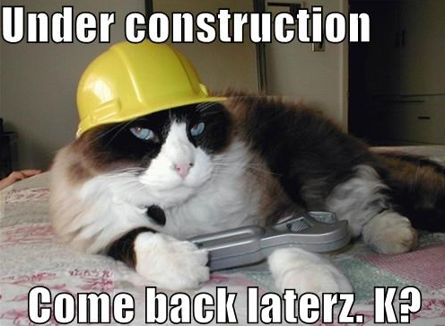

---

This is the third post of 3 post series on Custom React Renderers.This post will cover **the update phase of the renderer**.

I strongly recommend you to read earlier posts before reading this post.

- <a href='/react-custom-renderer-1/' target='_blank'>⚛️👆 Part 1/3 - Beginners guide to React Renderers...</a> and
- <a href='/react-custom-renderer-2/' target='_blank'>⚛️✌️ Part 2/3 - Beginners guide to React Renderers...</a>.

---

 
 

I am working on this post at the moment. Come back and check it out in 2-3 days! 😬

 
 

