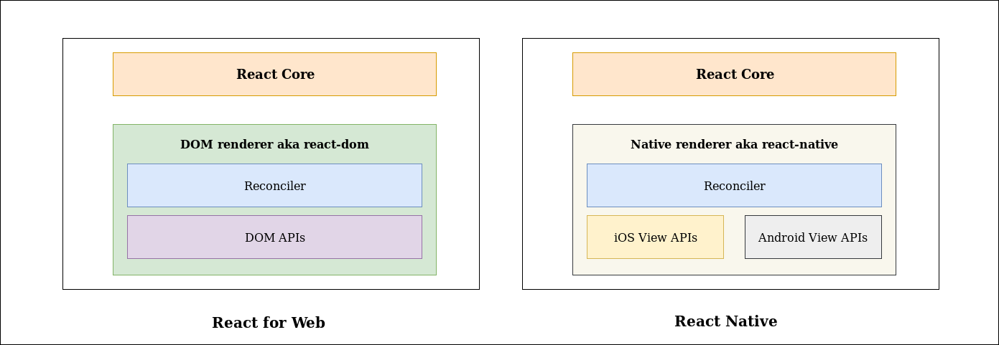
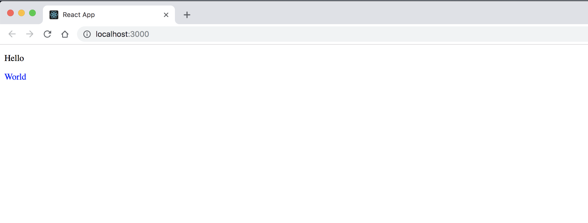
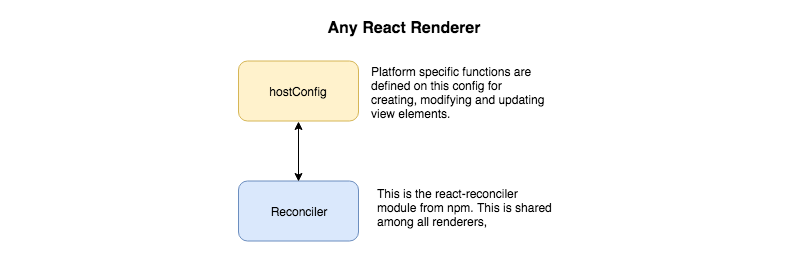

React helps you write your UI declaratively.
<a href="https://codeburst.io/declarative-vs-imperative-programming-a8a7c93d9ad2" target="_blank">More on declarative vs imperative here</a>. It was initially developed for Web, but since then it has been extended as
<a href="https://facebook.github.io/react-native/" target="_blank">React Native</a>,
<a href="https://github.com/Flipboard/react-canvas" target="_blank">React Canvas</a>,
<a href="https://github.com/nitin42/redocx" target="_blank">Redocx</a>,
<a href="https://github.com/diegomura/react-pdf" target="_blank">React PDF</a> and even
<a href="https://github.com/iamdustan/react-hardware" target="_blank">React Hardware</a>.

<a href="https://github.com/chentsulin/awesome-react-renderer" target="_blank">There are a lot more out there and you can find them here</a>

I always wanted to learn how these renderers worked and in this post, I will explore React Renderers in detail. One of the talks that inspired me to take a look into this was by <a href="http://kenwheeler.github.io/" target="_blank">Ken Wheeler</a> at React Amsterdam 2017

<iframe width="560" height="315" src="https://www.youtube.com/embed/oPofnLZZTwQ" frameborder="0" allow="autoplay; encrypted-media" ></iframe>

<br />
<br />
<hr />

**_Most of the content on this post is a result of my experimentation with React and reading through multiple react renderer codebases and blog posts. If you find any corrections in this post or any other extra details, please let me know in the comments._**

# 📖 Before we dive in

Before we go ahead and implement custom renderers that will drive cars and power nuclear power plants (Let your imagination go crazy 🌈), its a good idea to revisit some basics. You can safely skip them and dive straight to next section, if you consider yourself a react ninja 🤺 who can build react apps blindfolded 😎.

**Available React APIs from the main react module.** <a href="https://reactjs.org/docs/react-api.html" target="_blank"> https://reactjs.org/docs/react-api.html</a>

**Understanding JSX in depth.** <a href="https://reactjs.org/docs/jsx-in-depth.html" target="_blank">https://reactjs.org/docs/jsx-in-depth.html</a>

# ⚛️ React Core, Reconciler and Renderer

<a href="https://reactjs.org/docs/codebase-overview.html" target="_blank">React codebase</a> can be divided into three major parts:

### React Core

React core only includes the APIs necessary to define components. It contains all the top level React APIs like:

- React.createElement()
- React.createClass()
- React.Component
- React.Children
- React.PropTypes

It doesnt include the diffing algorithm or any platform specific code.

### Renderer

React was originally created for the DOM but it was later adapted to also support native platforms with React Native. This introduced the concept of "renderers" to React internals. Renderers manage how a React tree turns into the underlying platform calls. For example:

- React-Dom renders the component tree into respective dom elements.
- React Native renders the component tree into respective native platform views.



### Reconciler

Reconciler is the diffing algorithm that helps react figure out which dom elements to update on a state change. It is the part of React code that is shared between multiple platform renderers like React Dom, React Native, React ART etc.
There are two types of reconcilers:

- **Stack reconciler**: The “stack” reconciler is the implementation powering React 15 and earlier. It is written in an object-oriented way and maintains a separate tree of "internal instances" for all React components. The internal instances exist both for user-defined ("composite") and platform-specific ("host") components. The internal instances are inaccessible directly to the user, and their tree is never exposed. It is important to understand that the stack reconciler always processes the component tree synchronously in a single pass. The stack reconciler can't pause, and so it is suboptimal when the updates are deep and the available CPU time is limited. You can read more about it here: <a href="https://reactjs.org/docs/implementation-notes.html" target="_blank">https://reactjs.org/docs/implementation-notes.html</a>

- **Fiber reconciler**: The Fiber reconciler is a complete rewrite of the stack reconciler. It is the default reconciler since React 16. Fiber reconciler can perform the reconciliation of the tree by splitting work into minor chunks and hence can prioritize, pause and resume work thus freeing up the main thread to perform work efficiently. Hence, it appears more responsive and fluid as compared to stack reconciler. It mainly has:

  - Ability to split interruptible work in chunks.
  - Ability to prioritize, rebase and reuse work in progress.
  - Ability to yield back and forth between parents and children to support layout in React.
  - Ability to return multiple elements from render().
  - Better support for error boundaries.

  To know more about fiber <a href=" https://www.youtube.com/watch?v=ZCuYPiUIONs" target="_blank">you can watch the Cartoon intro to Fiber by Lin Clark</a>

  To know more about **Async rendering**:

  - **Time slicing & Suspense**: <a href="https://www.youtube.com/watch?v=nLF0n9SACd4" target="_blank"> https://www.youtube.com/watch?v=nLF0n9SACd4</a> and <a href="https://youtu.be/6g3g0Q_XVb4?t=1659" target="_blank"> https://youtu.be/6g3g0Q_XVb4?t=1659</a> talks by Dan Abramov.

#🕵🏻‍ Components, Instances, Elements and Fiber

Lets say we have a react app that looks like this:

```js
import React from 'react'
import ReactDom from 'react-dom'

class MyButton extends React.Component {
  state = { text: 'click me' }
  onBtnClick = () => {
    this.setState(() => ({ text: 'I was clicked' }))
  }
  render() {
    return <button onClick={this.onBtnClick}> {this.state.text} </button>
  }
}

const Content = props => <p>{props.text}</p>

const App = () => {
  return (
    <div>
      <p style="padding:20px">Hello World</p>
      <Content text="hello world" />
      <MyButton />
    </div>
  )
}

ReactDom.render(<App />, document.getElementById('root'))
```

Few fundamental units in the react-reconciler.

### Component

In the above example: **MyButton**, **Content** and **App** are essentially components that you define. A Component can be defined as a class (MyButton) or as a function (Content and App). It is basically a declaration of how the UI elements should look and behave.

With respect to renderers there are two types of react components:

- **Host Components**: Host components are platform-specific components, such as `<div>` or a `<View>` and they run platform-specific code such as mounting, updates, and unmounting of DOM/Native view. They typically begin with lower-case in the case of ReactDom.

- **Composite Components**: Composite components are user-defined components such as `<MyButton>` or `<Content>` and they behave the same way with all renderers. React will calls methods, such as render() and componentDidMount(), on the user-supplied composite components.

### Instances

For components declared as a class, the instances are the in memory initialized version of the components. An instance is what you refer to as **this** in the component class you write. It is useful for storing local state and reacting to the lifecycle events. There can be multiple independent instances of the same component. We will never create these instances manually, they will be managed by React. Also, functional components don’t have instances at all.

### Elements

An element is an immutable plain object describing a component instance or DOM node and its desired properties. The render function of the component returns an element. In case of functional components. The input is props while the output is a react element. Since elements are just plain light JS objects they are easy to traverse and don’t need to be parsed.

To explain it lets take an example:

Here **Content** is a functional component.

```js
const Content = props => {
  return <p style={props.style}>{props.text}</p>
}
```

Lets say we use it as

```js
<Content style="background:blue;" text="hello world" />
```

This will tell React to call

```js
Content({ text: 'hello world', style: 'background:blue;' })
```

If we **console.log** it, we get

```js
console.log(Content({ text: 'hello world', style: 'background:blue;' }))
// This logs
{
  "type":"p",
  "props":{
    "style":"background:blue;",
    "children":"hello world"
  },
}
```

This is a react element for the component. It contains only information about the component type **p**, its props (style, children). In otherwords, it is a lightweight javascript object that contains only the information needed to draw the element on the screen.

Now what if we do this with App:

```js
const App = () => {
  return (
    <div>
      <p style="padding:20px">Hello World</p>
      <Content text="hello world" />
      <MyButton />
    </div>
  )
}
console.log(App())
// This would log
{
   "type": "div",
   "props": {
      "children":[
         {
            "type":"p",
            "props":{
               "style":"padding:20px",
               "children":"Hello World"
            },
         },
         {
           "type": ƒ Content(props),
           "props": {"text":"hello world"},
         },
         {
           "type": ƒ MyButton()
         },
      ]
   },
}
```

If you notice carefully, The second and third child has type which is not a string. They are functions(basically components). Now, react reconciler would call render on those children for which the type is not a string. This would happen recursively till react can resolve all the types to strings. Hence, if a react element type is a string it is a dom element otherwise it is a Component.

I recommend reading the more detailed version by Dan Abramov here: <a href="https://reactjs.org/blog/2015/12/18/react-components-elements-and-instances.html" target="_blank">https://reactjs.org/blog/2015/12/18/react-components-elements-and-instances.html</a>

### fiber

This was introduced in the new React Fiber Reconciler. A fiber (lowecase f) is a JavaScript object that contains information about a component, its input and output. It has a one to one relation with the instance. It manages the work for the instance. The fiber keeps track of the instance using the property stateNode. And it also has information about its relationship with other instances. At any time, a component instance has at most two fibers that correspond to it: the current (flushed fiber or rendered fiber) and the work-in-progress fiber. A fiber node looks like this

```js
{
  child, stateNode, siblings, alternate, return, type, key
}
```

<a href="https://github.com/facebook/react/blob/9ea4bc6ed607b0bbd2cff7bbdd4608db99490a5f/packages/react-reconciler/src/ReactFiber.js#L406" target="_blank">From the source code </a> I could understand that React Fiber reconciler uses the react element to generate a react fiber for the component instance. So you can think of it as a react element with time management super powers🥇.
<a href='https://giamir.com/what-is-react-fiber' target='_blank'>You can find more details about the fiber here</a>

Now that we are done with crash course on React Internal elements, lets do what we came here for.


# 👷🏻‍ Lets build a custom renderer

## Boilerplate setup

Lets create a basic create-react-app project.

```sh
npx create-react-app renderer
cd renderer
```

Now delete all the files inside the **src/** directory except **index.js**.
And create a directory structure like this.

```sh
.
├── README.md
├── package.json
├── node_modules
├── public
├── src
│   ├── index.js #remove everything except index.js
│   └── renderer
│       └── index.js  #This is a new file
└── yarn.lock
```

Now modify **src/index.js** to look like this:

```js
import React from 'react'
import ReactDOM from 'react-dom'

const Text = props => {
  return <p className={props.className}>{props.content}</p>
}

const App = () => {
  return (
    <div>
      <Text className="hello-class" content="Hello" />
      <span style={{ color: 'blue' }}>World</span>
    </div>
  )
}

ReactDOM.render(<App />, document.getElementById('root'))
```

Run it

```sh
npm start
```

<br/>

You should see our basic app loaded up on http://localhost:3000/ and it should look like this.
<br/>
<br/>


<hr/>
The basic premise is that our renderer should be able to render the same result for the App component.

Modify our **src/index.js** to use our renderer(Lets call it Custom Renderer) instead of **react-dom**

```js
import React from 'react'
// import ReactDOM from "react-dom";
import CustomRenderer from './renderer'

const Text = props => {
  return <p className={props.className}>{props.content}</p>
}

const App = () => {
  return (
    <div>
      <Text className="hello-class" content="Hello" />
      <span style={{ color: 'blue' }}>World</span>
    </div>
  )
}

// ReactDOM.render(<App />, document.getElementById("root"));
CustomRenderer.render(<App />, document.getElementById('root'))
```

Lets add some code to **src/renderer/index.js**

```js
const CustomRenderer = {
  render(element, renderDom, callback) {
    // element: This is the react element for App component
    // renderDom: This is the host root element to which the rendered app will be attached.
    // callback: if specified will be called after render is done.
    console.log('render called', element, renderDom, callback)
  },
}

module.exports = CustomRenderer
```

Now if we check http://localhost:3000 we should see a blank white screen but checking our browser console we should see:

```js
render called {$$typeof: Symbol(react.element), type: ƒ, key: null, ref: null, props: {…}, …} div#root undefined
```

<a href='https://github.com/master-atul/blog-custom-renderer/tree/5306e949bba475f80cab5a042535af5755c0aa43' target='_blank'>Link to source code till here</a>

Cool😎!! . Now to figure out what goes into render function, I had to read through multiple renderer codebases and documentations. This is what I understood.👨🏻‍🎓

- The React team exported an experimental version of **react-reconciler** as a npm package.
- Every platform renderer, be it dom, react native, etc has to have its own configuration called **hostConfig** along with the **react-reconciler**. Renderers are required implement all the necessary platform specfic functions inside the **hostConfig**. The <a href='https://github.com/facebook/react/tree/master/packages/react-reconciler' target='_blank'>
  react-reconciler</a> module inside the renderer will call the platform specific functions via the supplied hostConfig to perform dom changes or view updates.



Now lets install **react-reconciler** package from npm.

```sh
yarn add react-reconciler
```

Now modify **src/renderer/index.js**

```js
const Reconciler = require('react-reconciler')

const HostConfig = {
  //TODO We will specify all required methods here
}
const reconcilerInstance = Reconciler(HostConfig)

const CustomRenderer = {
  render(element, renderDom, callback) {
    // element: This is the react element for App component
    // renderDom: This is the host root element to which the rendered app will be attached.
    // callback: if specified will be called after render is done.

    const isAsync = false // Disables async rendering
    const container = reconcilerInstance.createContainer(renderDom, isAsync) // Creates root fiber node.

    const parentComponent = null // Since there is no parent (since this is the root fiber). We set parentComponent to null.
    reconcilerInstance.updateContainer(
      element,
      container,
      parentComponent,
      callback
    ) // Start reconcilation and render the result
  },
}

module.exports = CustomRenderer
```

**Whats happening?**

- First we create an instance of the reconciler. We pass the hostConfig as its parameter. We will define the methods inside hostConfig in a bit.
- Now inside the render method, our first step is to create a root fiber node (container) corresponding to the renderDom element. We do this by calling **reconcilerInstance.createContainer**. The root fiber node will be used by the reconciler to manage all the updates to the renderDom.
- After we create the root fiber node (container), we will call **reconcilerInstance.updateContainer**. This will initiate reconcilation and the subsequent rendering.

Now you might have noticed we set **isAsync** to false. This parameter is used to set the mode of working for the fiber node. When set to false it disables AsyncMode.<br/>
A fiber can run on a mixture of modes. Few of them are:<br/>

- **AsyncMode** - Enables Async rendering. But since it is not stable yet, it is disabled on all renderers by default. Check status <a href='https://github.com/facebook/react/issues/13206#issuecomment-407535077' target='_blank'>of async rendering here.</a> <br/>
- **StrictMode** - Enables <a href='https://reactjs.org/docs/strict-mode.html' target='_blank'>React Strict mode.</a> <br/>
- **ProfileMode** - Helps in performance profiling I guess. 🤷🏻‍ <br/>
- **NoContext** - When no mode is not specified.

At the time of writing this blog, React 16.5.2, React Native 0.57 and all currently available release versions of renderers have async mode disabled. So they all are running on sync mode at the moment. Also,

> When a fiber is created, it inherits the mode of its
> parent. Additional flags can be set at creation time, but after that the
> value should remain unchanged throughout the fiber's lifetime.

Hence when we set the mode of container (root fiber) as not async. All remaining child fibers will be non async too. More about <a href='https://github.com/facebook/react/blob/b5c0852fddda9abdab25b101a040e607877f4663/packages/react-reconciler/src/ReactFiber.js#L85' target='_blank'>**fiber node here**.</a>

<a href='https://github.com/master-atul/blog-custom-renderer/tree/b0f74ffc14eecceb259c5b302cf170cce843d3b1' target='_blank'>Link to source code till here</a>

# References

- Building React From Scratch by Paul O Shannessy - <a href="https://www.youtube.com/watch?v=_MAD4Oly9yg" target="_blank" >https://www.youtube.com/watch?v=\_MAD4Oly9yg</a>
- https://reactjs.org/docs/react-api.html
- https://reactjs.org/blog/2015/12/18/react-components-elements-and-instances.html
- https://reactjs.org/docs/jsx-in-depth.html
- https://reactjs.org/docs/implementation-notes.html
- https://medium.com/@agent_hunt/react-is-also-the-llvm-for-creating-declarative-ui-frameworks-767e75ce1d6a
- https://medium.com/@agent_hunt/hello-world-custom-react-renderer-9a95b7cd04bc
- https://github.com/nitin42/Making-a-custom-React-renderer
- https://goshakkk.name/react-custom-renderers/
- https://hackernoon.com/learn-you-some-custom-react-renderers-aed7164a4199
- https://giamir.com/what-is-react-fiber
- React Suspense implementation by Kent C. Dodds : <a href='https://www.youtube.com/watch?v=7LmrS2sdMlo' target='_blank'>https://www.youtube.com/watch?v=7LmrS2sdMlo</a>
- https://github.com/sw-yx/fresh-async-react
- https://github.com/acdlite/react-fiber-architecture
- https://reactjs.org/docs/codebase-overview.html
